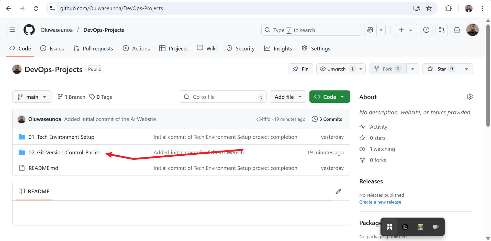
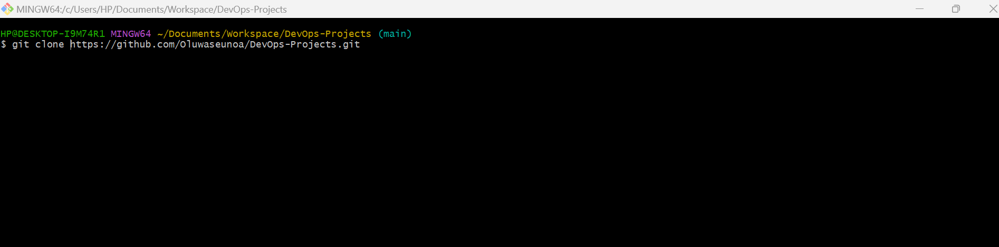
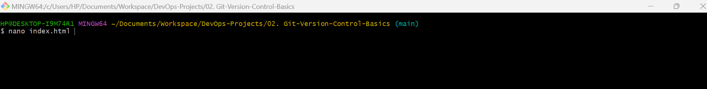
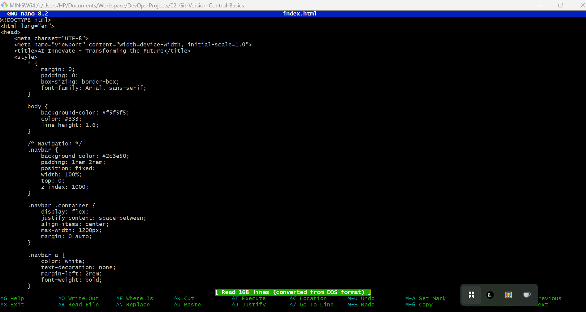
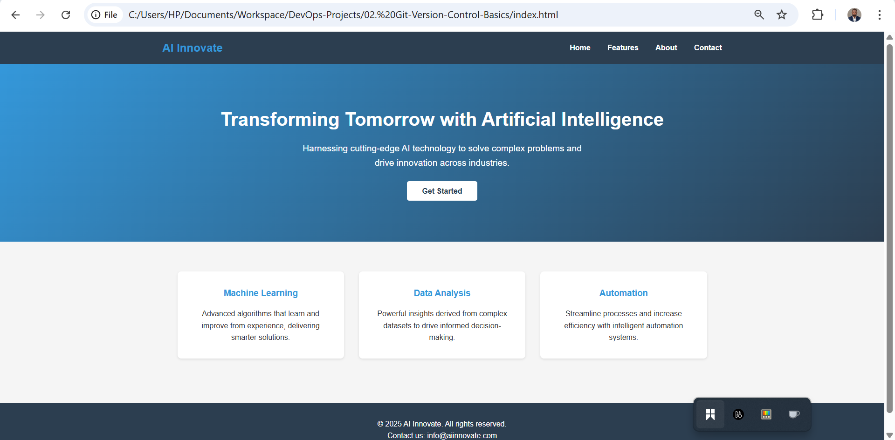
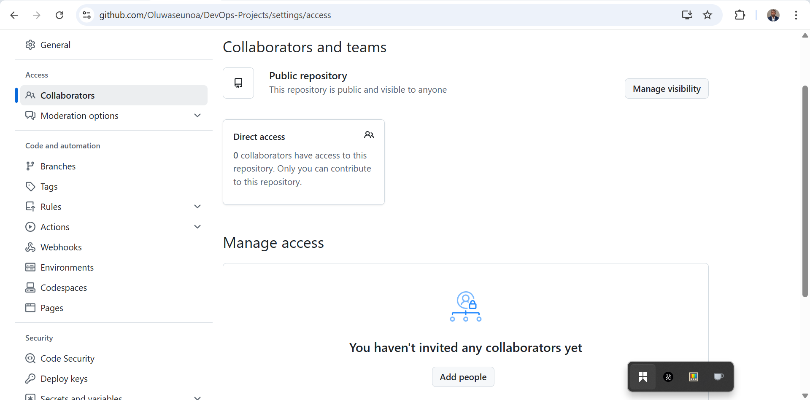
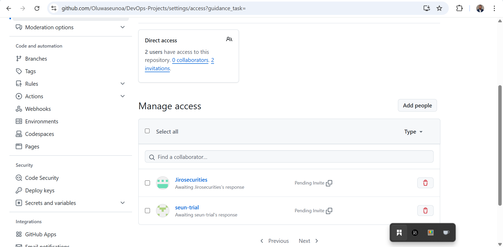

# 🧪 Hands-On Git Collaboration: Version Control System in Action

## 👋 Project Overview

This project demonstrates the practical use of a **Version Control System (VCS)** in a collaborative software development environment using **Git** and **GitHub**. It simulates a team scenario where multiple contributors work on different sections of a web project while preserving each other’s work, resolving conflicts, and managing pull requests.

The simulation involves three GitHub accounts:
- 👤 `Oluwaseunoa`: Project Owner & Developer
- 👨‍💻 `Seuntrial`: Collaborator Developer (feature contributor)
- 👀 `Jirosecurities`: Reviewer (code reviewer)

---

## 🔧 Project Setup

### Step 1: Oluwaseunoa Creates the Repository

- Log in to my [GitHub Account](https://github.com/login) and create a Git repository called `02. Git-Version-Control-Basics`



- Clone the repository to my local computer


- Adds an `index.html` file with the code for the website




- View website on favourite browser



- Stage, commit and push changes

```bash
git add .
git commit -m "Added initial commit of the AI Website"
git push
```

### Step 2: Add Collaborators

- Seuntrial and Jirosecurities are added as collaborators from the repository settings.






### Step 3: Seuntrial Clone the Reository and Create Branch

```bash
git clone https://github.com/Oluwaseunoa/ai-startup-website.git
cd ai-startup-website
git checkout -b update-navigation
```

