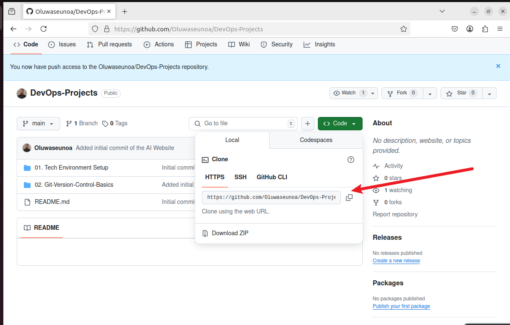
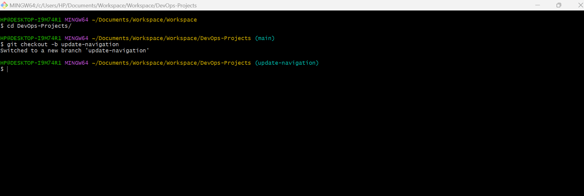
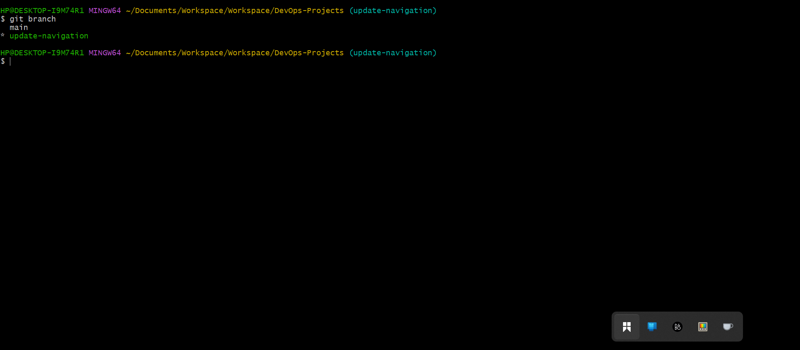
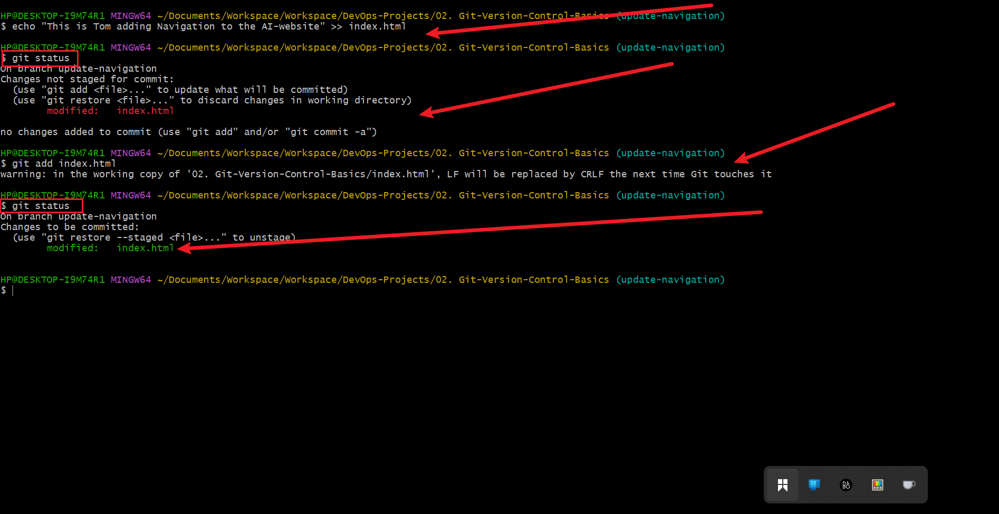
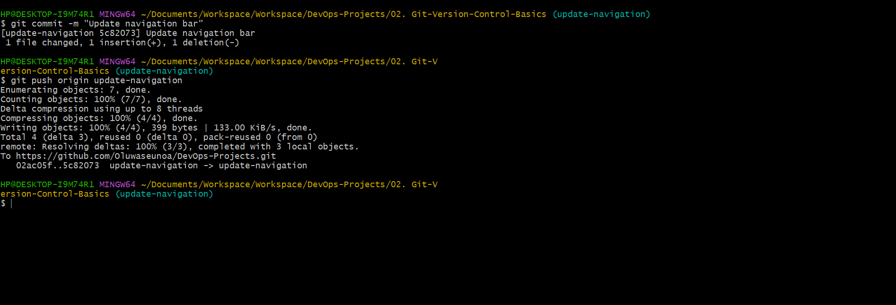

# 🧑‍💻 Hands-On Git Project: Collaborative Website Development with Git and GitHub

In this mini project, we simulate a collaborative Git and GitHub workflow using two contributors — Tom and Jerry. The project covers Git installation, setting up a GitHub repository, cloning, branching, modifying content, committing changes, and pushing to the main repository.

---

## 🛠️ Part 1: Setup and Initial Configuration

### 1. Install Git  
- Visit the [official Git website](https://git-scm.com/) and [download](https://git-scm.com/downloads) the version of Git for your operating system.  
- Follow the installation instructions.


---

### 2. Create a GitHub Repository  
- Sign up or log in to [GitHub](https://github.com/).  
- Click the "+" icon in the top-right corner and select **"New repository"**.


- Name your repository (e.g., `03. Mini Project - Basic Git Commands`) and initialize it with a **README** file.  
- Click **"Create repository"**.


---

### 3. Clone the Repository  

- On your repository page on GitHub, click the **"Code"** button and copy the **HTTPS URL**.



- Open your terminal or command prompt.

- Create a folder named `DevOps-Projects` in your desired directory (e.g., `Documents/Workspace/DevOps-Projects`) and navigate to it:

```bash
mkdir ~/Documents/Workspace/DevOps-Projects
cd ~/Documents/Workspace/DevOps-Projects
```

- Clone (download) the repository using:

```bash
git clone https://github.com/Oluwaseunoa/DevOps-Projects.git
```


- Your default branch will be `main`.

- Navigate into the cloned repository:

```bash
cd /DevOps-Projects/03. Mini Project - Basic Git Commands/
```

- Create a file named `index.html` and add the content below:

```bash
touch index.html
echo "This is the Admin creating an index.html file for Tom and Jerry." > index.html
```

- Check that changes haven't been staged:

```bash
git status
```

- Stage the changes:

```bash
git add index.html
```

- Confirm staging:

```bash
git status
```

> ✅ The file name will appear in green, indicating it is staged.

- Commit the changes:

```bash
git commit -m "This is my first commit"
```

- Push the `main` branch to GitHub:

```bash
git push origin main
```
This sends commits from your main branch on your laptop to GitHub
(Remote Repository).
---

## 👥 Part 2: Simulating Tom and Jerry's Work

We'll simulate both Tom and Jerry working on the same machine by using branches.

---

### 🧑 Tom’s Work

- Navigate to the project directory:

```bash
cd DevOps-Projects\03. Mini Project - Basic Git Commands
```

- Check the current branch:

```bash
git branch
```

- Create a new branch for Tom's changes:

```bash
git checkout -b update-navigation
```



- Check the active branch again:

```bash
git branch
```



- Modify `index.html` and add:

```html
This is Tom adding Navigation to the AI-website.
```
This simulates Tom's contribution to the project. This text represents the
work he's doing on the navigation bar. In the real world, this will be an
actual software code.

- Check for unstaged changes:

```bash
git status
```


> 🚩 The file name will appear in red, indicating changes are unstaged.

- Stage the changes:

```bash
git add index.html
```

- Confirm staging:

```bash
git status
```



- Commit Tom’s changes:

```bash
git commit -m "Update navigation bar"
```

- Push Tom’s branch:

```bash
git push origin update-navigation
```



---

### 🧑 Jerry’s Work

- Switch back to the `main` branch:

```bash
git checkout main
```

- Pull latest changes (e.g., Tom’s update):

```bash
git pull origin update-navigation
```


- Create a new branch for Jerry's work:

```bash
git checkout -b add-contact-info
```

- Edit `index.html` and add the following content:

```html
Contact us at: contact@ai-startup.com
```

- Stage Jerry's changes:

```bash
git add index.html
```

- Commit Jerry’s changes:

```bash
git commit -m "Add contact information"
```

- Push Jerry's branch:

```bash
git push origin add-contact-info
```


---

## ✅ Summary

At this point:
- Tom created a branch `update-navigation` and added navigation details.
- Jerry created a branch `add-contact-info` and added contact information.
- Both contributors successfully pushed their branches to GitHub.

## 🌐 GitHub Repository

🔗 [View on GitHub](https://github.com/Oluwaseunoa/DevOps-Projects)
