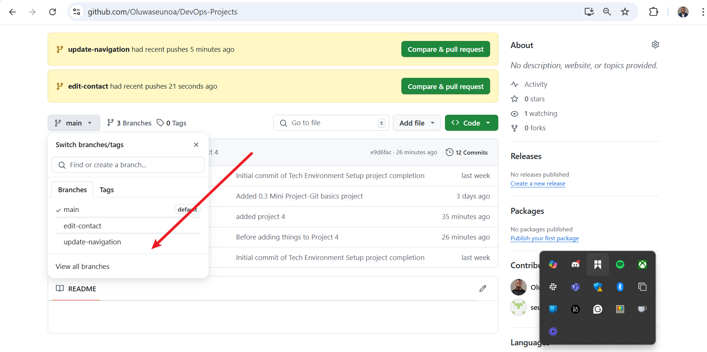
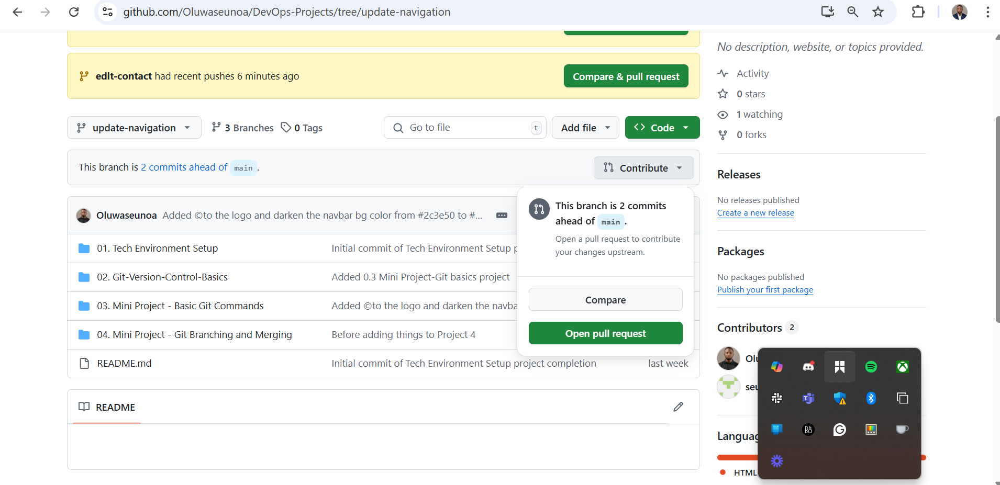
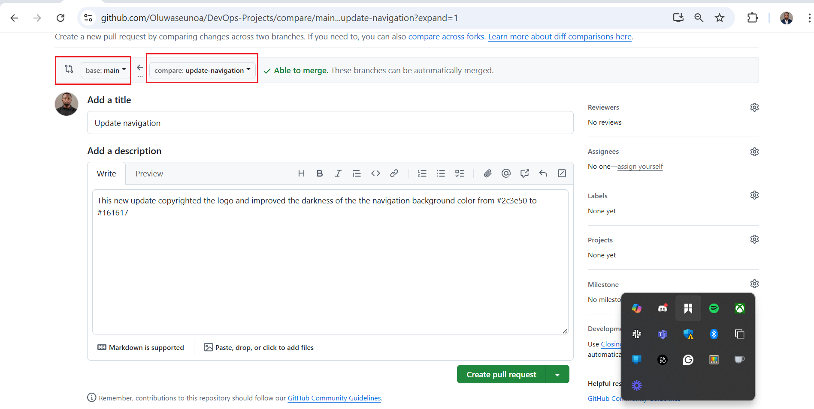

# Mini Project – Git Branching and Merging

This project demonstrates how multiple developers (Tom and Jerry) can collaborate on a project using Git branching and merging strategies. It outlines the process of creating and reviewing Pull Requests (PRs) before merging into the main branch.

---

## 🔀 Workflow Overview

After both Tom and Jerry have pushed their changes, the next step is to:

1. Create a Pull Request.
2. Merge the Pull Request into the main branch.

---

## 📌 Understanding Pull Requests

A **Pull Request (PR)** is a GitHub feature (also used in other Git-based systems) that allows developers to:
- Propose changes,
- Request reviews,
- Discuss implementations,
- Merge changes after approval.

This is a core feature of collaborative development in DevOps workflows.

---

## 🧑‍💻 How to Create a Pull Request on GitHub

Assuming Tom and Jerry have pushed their branches:
git checkout -b update-navigation

```bash
git checkout -b update-navigation
# made changes...
git add .
git commit -m "Update navigation menu"
git push origin update-navigation
```

### Example: Creating a PR for Tom’s Changes

1. **Navigate to the Repository**  
   Open your browser and go to the GitHub page for the repository.

2. **Switch to the Branch**  
   Use the branch dropdown near the top-left and select `update-navigation` (Tom’s branch).  
   
   

3. **Create a New Pull Request**  
   Click the `New pull request` button next to the branch dropdown.  
   

   GitHub sets the base branch as `main` and the compare branch as Tom’s.

4. **Review Tom's Changes**  
   Check the file differences between the main branch and `update-navigation`. Verify the changes.

5. **Create the Pull Request**  
   Click `Create pull request`, enter a concise title and a detailed description explaining:
   - What was changed
   - Why it matters
   - Any additional notes  
   Click `Create pull request` again to submit. 

   

---

## ✅ Reviewing and Merging Tom’s PR

Team members can now:
- Review and comment,
- Request changes if necessary,
- Approve and merge once everything looks good.

After approval, someone with merge rights clicks `Merge pull request` to integrate `update-navigation` into `main`.

---

## 🧠 Updating Jerry’s Branch Before Merging

To prevent merge conflicts and ensure compatibility, Jerry must update his branch (`add-contact-info`) with the latest changes from `main` (including Tom's updates).

### Steps in Terminal:

```bash
# Switch to Jerry's branch
git checkout add-contact-info

# Pull the latest updates from main into Jerry's branch
git pull origin main
```

> This command fetches the latest main branch (with Tom’s merged updates) and merges them into Jerry's branch.

---

## 🚀 Finalizing Jerry’s Contribution

Once up-to-date:

1. **Push Updated Branch to GitHub**

```bash
git push origin add-contact-info
```

This ensures the remote `add-contact-info` branch includes both Jerry's work and recent updates from `main`.

2. **Create a Pull Request for Jerry**  
   Follow the same steps as done for Tom.

3. **Merge the PR into Main**  
   After review and approval, merge Jerry’s branch into `main`.

---

## 🧩 Summary

This workflow showcases how Git enables seamless collaboration between multiple developers:

- Isolated development using branches.
- Centralized review through Pull Requests.
- Controlled integration using merge strategies.

Even when working on similar parts of a codebase, this approach ensures stability, clarity, and traceability.

## 🌐 GitHub Repository

🔗 [View on GitHub](https://github.com/Oluwaseunoa/DevOps-Projects)


