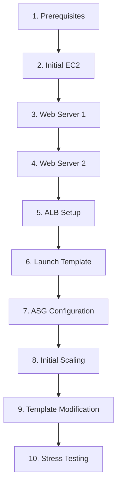

# Configuring Auto Scaling with Application Load Balancer using Launch Template

## Table of Contents

| **Category** | **Steps** | **Description** |
|--------------|-----------|-----------------|
| **1. Prerequisites & Setup** | 1-5 | EC2 access, Key Pair creation |
| **2. Initial EC2 Instances Creation** | 6-14 | AWS CLI scripting & automated instance launch |
| **3. Web Server Configuration (Instance 1)** | 15-33 | Apache + PHP setup with dynamic content |
| **4. Web Server Configuration (Instance 2)** | 34-46 | Replicate configuration on second instance |
| **5. Application Load Balancer (ALB) Setup** | 47-72 | Target Group creation & ALB configuration |
| **6. Launch Template & AMI Creation** | 73-96 | AMI creation from configured instance |
| **7. Auto Scaling Group (ASG) Configuration** | 97-109 | ASG creation with scaling policies |
| **8. Scaling Validation & Testing** | 110-124 | Initial scaling demonstration |
| **9. Launch Template Modification** | 125-136 | Enable public IP for SSH access |
| **10. Advanced Scaling Testing** | 137-153 | CPU stress testing & full scaling validation |

## Detailed Step Categories

### **1. Prerequisites & Setup** (Steps 1-5)
**Objective**: Prepare AWS environment and security prerequisites
```
1-5: EC2 Access → Key Pair Creation → Download
```

### **2. Initial EC2 Instances Creation** (Steps 6-14)
**Objective**: Automate creation of baseline web server instances
```
6-14: AWS CLI Script → 2x EC2 Instances (t2.micro) → Running State
```

### **3. Web Server Configuration (Instance 1)** (Steps 15-33)
**Objective**: Deploy Apache + PHP with dynamic instance metadata
```
15-33: SSH Connect → Apache Install → PHP Dynamic Page → 
       Instance ID Display → Verification
```

### **4. Web Server Configuration (Instance 2)** (Steps 34-46)
**Objective**: Replicate exact configuration for high availability
```
34-46: SSH Instance 2 → Apache + PHP → Dynamic Content → 
       Both instances serving identical content
```

### **5. Application Load Balancer (ALB) Setup** (Steps 47-72)
**Objective**: Configure traffic distribution across instances
```
47-72: ALB Creation → Target Group → Register Instances → 
       Round-Robin Load Balancing → Health Checks
```

### **6. Launch Template & AMI Creation** (Steps 73-96)
**Objective**: Create reusable instance configuration template
```
73-96: ASG Setup → AMI Creation → Launch Template → 
       Key Pair + Security Group Configuration
```

### **7. Auto Scaling Group (ASG) Configuration** (Steps 97-109)
**Objective**: Implement automatic scaling infrastructure
```
97-109: ASG Creation → Target Tracking (50% CPU) → 
       ALB Integration → Initial Launch
```

### **8. Scaling Validation & Testing** (Steps 110-124)
**Objective**: Verify initial auto-scaling functionality
```
110-124: 3rd Instance Launch → Load Balancer Distribution → 
         Round-Robin Verification
```

### **9. Launch Template Modification** (Steps 125-136)
**Objective**: Enable SSH access to auto-scaled instances
```
125-136: Version 2 Creation → Public IP Enable → 
         ASG Template Update → Termination/Replacement
```

### **10. Advanced Scaling Testing** (Steps 137-153)
**Objective**: Full end-to-end scaling validation with stress testing
```
137-153: CPU Stress (stress -c 4) → Multiple Instance Launch → 
         5x Instance Scale-Out → Health Check Verification
```

## Category Flow Diagram



## Quick Reference by Phase

| **Phase** | **Steps** | **Duration** | **Resources Created** |
|-----------|-----------|--------------|----------------------|
| Setup | 1-5 | 5 min | Key Pair |
| Instance Creation | 6-14 | 10 min | 2x EC2 |
| Web Config | 15-46 | 20 min | Apache + PHP |
| ALB | 47-72 | 15 min | ALB + Target Group |
| Template/ASG | 73-109 | 20 min | AMI + Launch Template + ASG |
| **Validation** | **110-153** | **30+ min** | **Full Scaling System** |

**Total Steps**: 153  
**Total Duration**: ~2 hours  
**Final Architecture**: ALB → ASG (1-5 instances) → Auto-scaling web servers