# Mastering Environment Variables and Infrastructure Environments in Cloud Scripting

**Author:** Oluwaseun Osunsola  
**Environment and Tools:** AWS, Ubuntu VM, Nano
**Project Link:** https://github.com/Oluwaseunoa/DevOps-Projects/tree/main 

## Project Overview
This mini project explores the distinctions between **infrastructure environments** (distinct stages like development, testing, and production) and **environment variables** (dynamic key-value pairs for configuration). Using a FinTech product scenario, it involves creating a Bash shell script, `aws_cloud_manager.sh`, to manage AWS cloud resources across environments. The script evolves incrementally: from basic conditionals to incorporating environment variables, avoiding hard-coding, using positional parameters, and adding validation for robustness.

Key skills demonstrated:
- Shell scripting in Bash
- AWS environment setup (local via VMware/Ubuntu, testing/production via EC2)
- Dynamic configuration management
- Best practices for reusable, error-free code

The project was executed on a local Ubuntu setup in VMware Workstation, with remote EC2 instances for testing and production. Below, I detail the process with code snippets, explanations, and embedded screenshots for visual proof.

## Section 1: Setting Up Infrastructure Environments
Infrastructure environments isolate development stages to prevent issues like data corruption. For this project:

- **Development (Local)**: Ubuntu OS in VMware Workstation on my laptop.
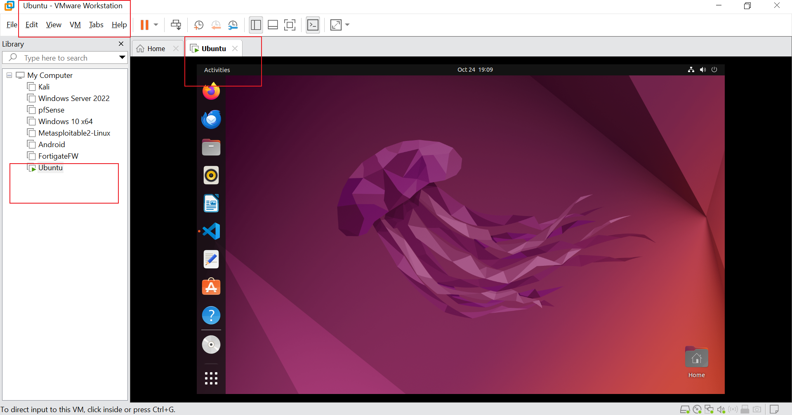 – Shows the local Ubuntu virtual machine where initial development occurred.

- **Testing (AWS Account 1)**: EC2 instance for simulated testing.
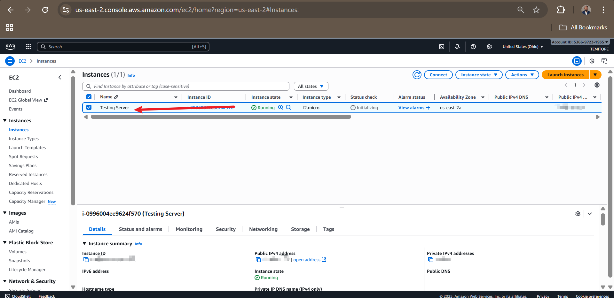 – Displays the AWS console with the testing EC2 instance.

- **Production (AWS Account 2)**: EC2 instance for live deployment.
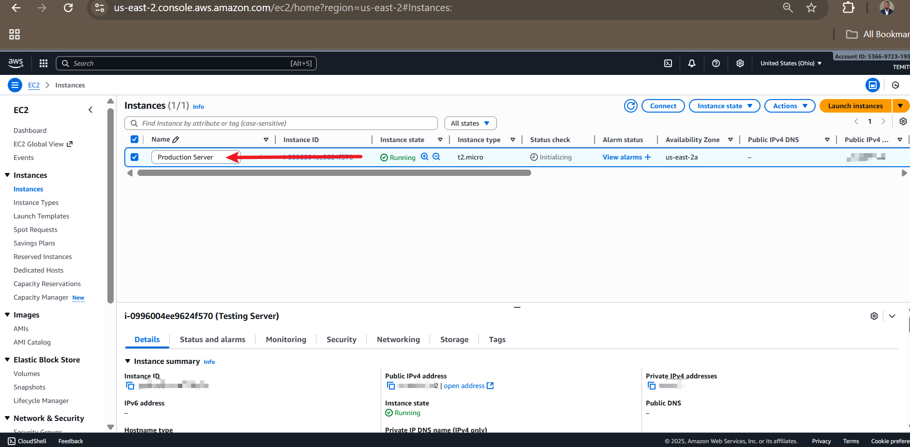 – Highlights the production EC2 instance in the separate AWS account.

These setups ensure code progresses safely from local experiments to customer-facing production.

## Section 2: Understanding Environment Variables
Environment variables allow scripts to adapt dynamically without changes. In the FinTech example, they handle varying database connections:

- **Local**: `DB_URL=localhost`, `DB_USER=test_user`, `DB_PASS=dev_pass`
- **Testing**: `DB_URL=db.example.com`, `DB_USER=test_user`, `DB_PASS=testing_pass`
- **Production**: `DB_URL=prod.db.example.com`, `DB_USER=prod_user`, `DB_PASS=secure_prod_pass`

This flexibility is key for reusable scripts across environments.

## Section 3: Developing the Shell Script
### 3.1 Initial Script Creation
Created `aws_cloud_manager.sh` using nano editor.

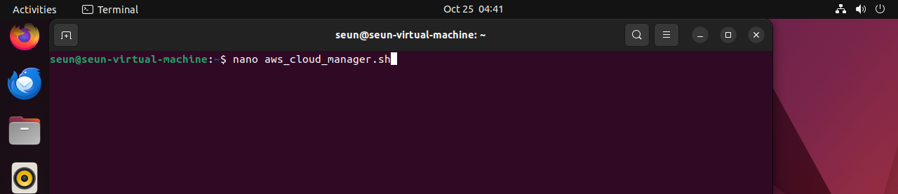 – Editing the initial script in the terminal.

**Initial Code**:
```bash
#!/bin/bash

# Checking and acting on the environment variable
if [ "$ENVIRONMENT" == "local" ]; then
  echo "Running script for Local Environment..."
  # Commands for local environment
elif [ "$ENVIRONMENT" == "testing" ]; then
  echo "Running script for Testing Environment..."
  # Commands for testing environment
elif [ "$ENVIRONMENT" == "production" ]; then
  echo "Running script for Production Environment..."
  # Commands for production environment
else
  echo "No environment specified or recognized."
  exit 2
fi
```

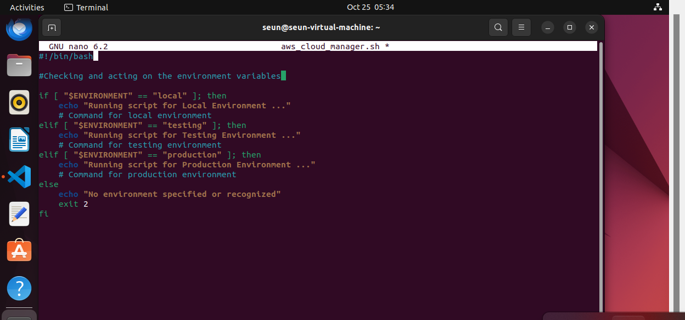 – Close-up of the conditional logic in the script.

Made it executable:
```bash
sudo chmod +x aws_cloud_manager.sh
```
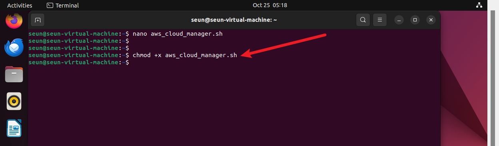 – Granting permissions.

### 3.2 Testing Without Environment Variable
Ran without setting `$ENVIRONMENT`:
```bash
./aws_cloud_manager.sh
```
Output: "No environment specified or recognized." (Exit 2).

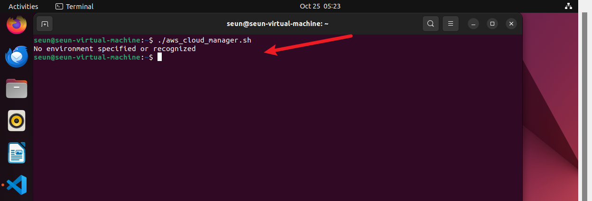 – Error output in terminal.

### 3.3 Using Export for Dynamic Variables
Set and ran:
```bash
export ENVIRONMENT=production
./aws_cloud_manager.sh
```
Output: "Running script for Production Environment..."

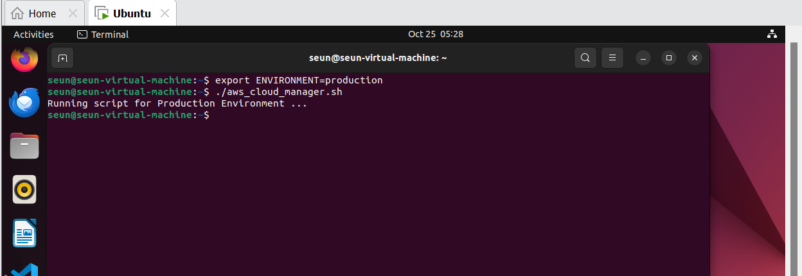 – Successful execution after export.

### 3.4 Hard-Coded Version (Anti-Pattern)
Modified to hard-code:
```bash
#!/bin/bash

ENVIRONMENT="testing"

# ... (rest of conditional logic)
```
Always outputs testing message – inflexible.

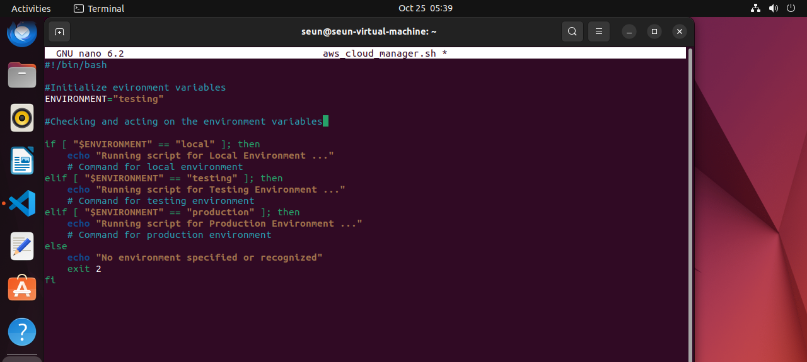 – Script with hard-coded value.
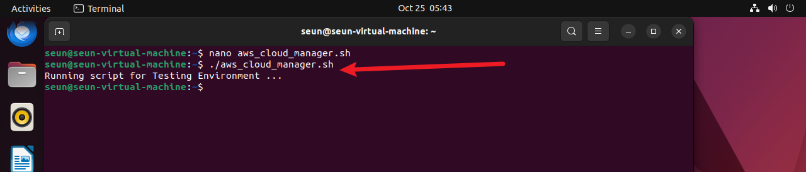 – Execution result.

## Section 4: Enhancing with Positional Parameters and Validation
### 4.1 Positional Parameters
Use arguments for runtime flexibility, e.g.:
```bash
./aws_cloud_manager.sh testing 5
```
Inside: `ENVIRONMENT=$1`, `NUMBER_OF_INSTANCES=$2`.

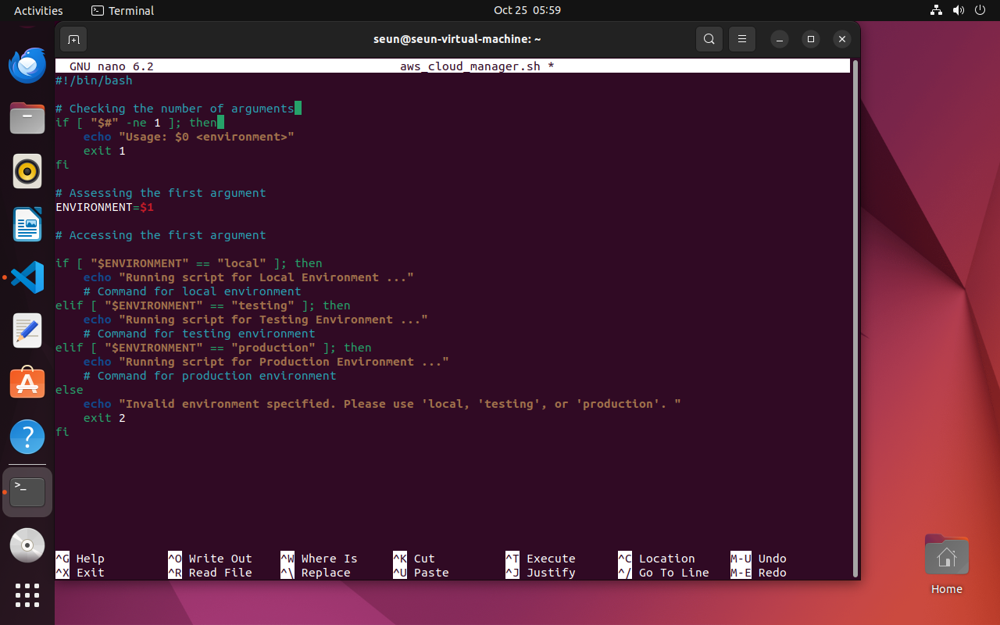 – Argument check code.

### 4.2 Final Script with Validation
Added check for exactly 1 argument:
```bash
#!/bin/bash

if [ "$#" -ne 1 ]; then
  echo "Usage: $0 <environment>"
  exit 1
fi

ENVIRONMENT=$1

if [ "$ENVIRONMENT" == "local" ]; then
  echo "Running script for Local Environment..."
elif [ "$ENVIRONMENT" == "testing" ]; then
  echo "Running script for Testing Environment..."
elif [ "$ENVIRONMENT" == "production" ]; then
  echo "Running script for Production Environment..."
else
  echo "Invalid environment specified. Please use 'local', 'testing', or 'production'."
  exit 2
fi
```

### 4.3 Testing the Final Script
- No args: Usage error (Exit 1).
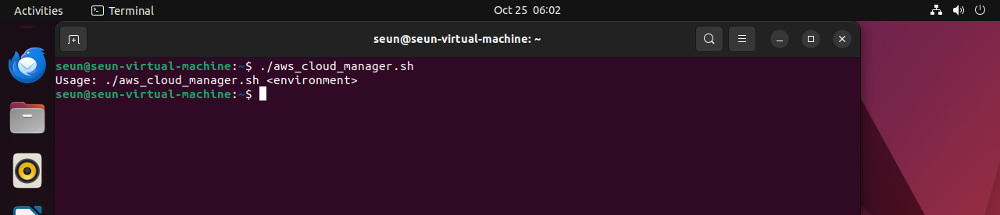
- Invalid arg: Invalid message (Exit 2).
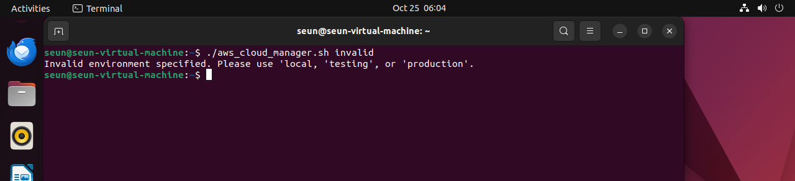
- Local: Success.
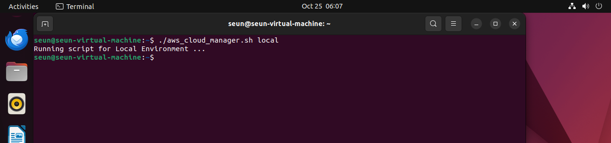
- Testing: Success.
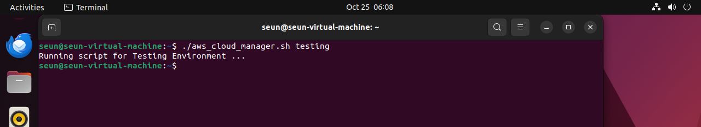
- Production: Success.
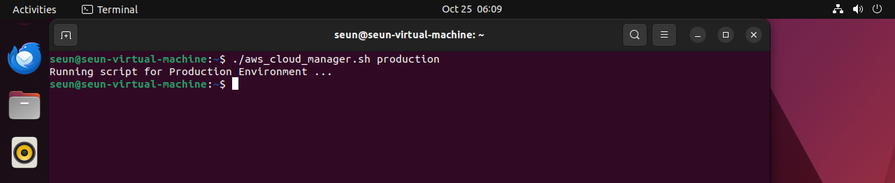

## Key Learnings and Challenges
This project reinforced incremental development, debugging (e.g., exit codes), and why dynamic configurations outperform hard-coding. Challenges included ensuring validation caught edge cases, solved by thorough testing.

## Summary Paragraph (Project Submission)
In this mini project, I learned the critical distinction between infrastructure environments—distinct stages like development (local Ubuntu/VirtualBox), testing (AWS Account 1 EC2), and production (AWS Account 2 EC2) for safe software lifecycle management—and environment variables, which are dynamic key-value pairs (e.g., DB_URL, DB_USER) enabling reusable scripts across these stages without hard-coding. Through developing `aws_cloud_manager.sh`, I explored incremental scripting: starting with conditional logic on unset variables leading to errors, using `export` for dynamic setting, recognizing hard-coding's limitations, and adopting positional parameters `($1, $2)` with validation `($# checks)` for flexibility and bug prevention. This approach fosters clean, maintainable code, as demonstrated by runtime arguments controlling environment-specific behavior, ultimately preparing for advanced cloud management tasks.

## Next Steps and Reflections
This project lays the foundation for integrating AWS CLI commands (e.g., provisioning EC2 instances). I'm excited to expand it into a full CI/CD pipeline. Feedback welcome – let's discuss on LinkedIn!

*Completed on October 25, 2025. All screenshots are from my implementation.*