# Microsoft Azure Fundamentals (AZ-900) — Section 3 Lab
## Azure Architecture: Resource Groups, Regions, Tagging & Governance

> **Lab Provider:** Dion Training | **Estimated Duration:** 15 minutes  
> **Platform:** Microsoft Azure (Free Account) | **Tools Used:** Azure Portal · Resource Groups · Storage Accounts · Cost Management · ARM · IAM
>**Completed by OLUWASEUN OSUNSOLA** [View LinkedIn](https://www.linkedin.com/in/oluwaseun-osunsola-95539b175/)

---

## 📋 Lab Overview

Continuing as IT consultant for **CloudFirst Retail**, this lab focused on establishing a proper organizational structure in Azure before any production workloads are deployed. The goal was to demonstrate how Azure's resource hierarchy works, how region selection impacts deployments, and how a tagging strategy enables accurate cost tracking — all core concepts for AZ-900 and real-world cloud governance.

---

## 🎯 Learning Objectives

- Create and configure Azure Resource Groups with proper naming conventions
- Deploy resources across different regions within the same Resource Group
- Implement a tagging strategy and observe that tags do **not** auto-inherit to resources
- Navigate the Azure organizational hierarchy: Subscriptions → Resource Groups → Resources
- View ARM deployment history to understand Infrastructure as Code (IaC)
- Explore RBAC role assignment and policy inheritance at the Resource Group level

---

## 🧰 Prerequisites

- Active Azure free account
- Access to the Azure Portal
- 15 minutes of focused time

**Azure Services Used:** Resource Groups · Storage Accounts · Azure Portal (Cost Management, Subscriptions, Deployments, Activity Log)

---

## 🪜 Step-by-Step Walkthrough

---

### Step 1 — Sign In to the Azure Portal

Signed into the Azure Portal at `https://portal.azure.com`. This is the entry point for all Azure resource management.

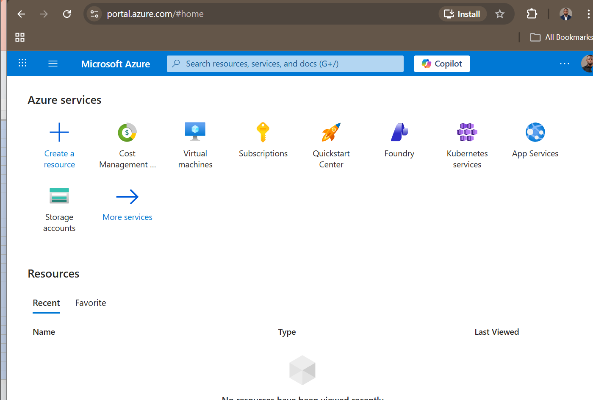

---

### Step 2 — Navigate to Resource Groups

Searched for **Resource groups** in the top search bar and navigated to the Resource Groups page. Resource Groups are the logical containers that organise every Azure resource — this is where governance, access control, and cost tracking begin.

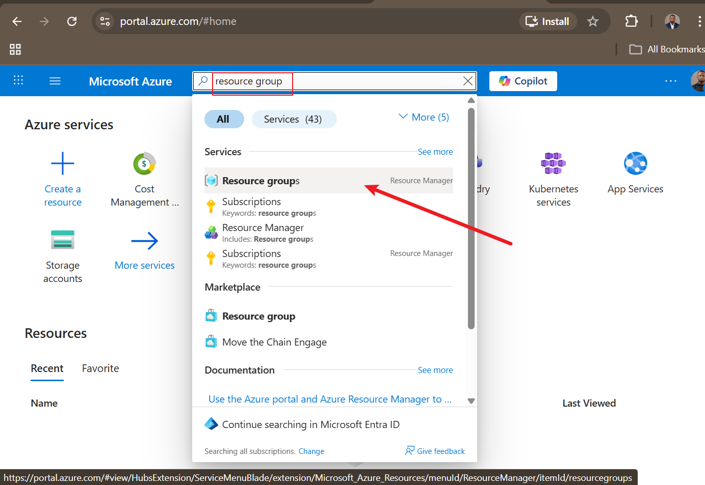

Clicked **+ Create** to begin creating a new Resource Group.

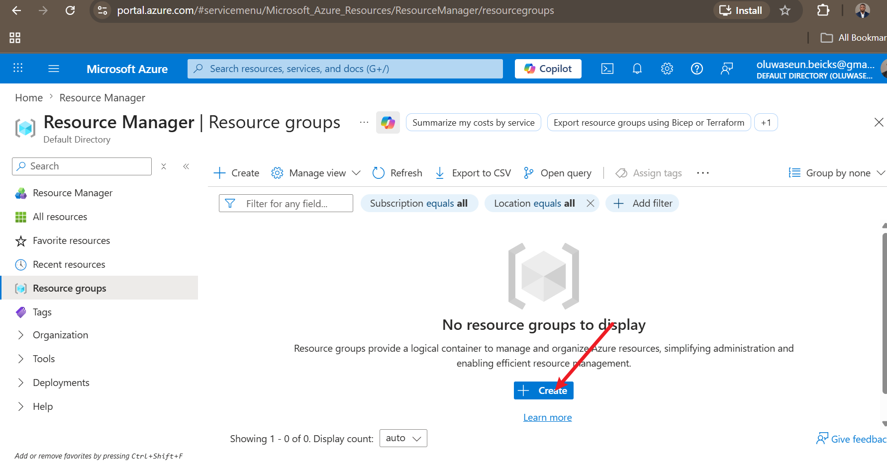

---

### Step 3 — Create the CloudFirst Retail Resource Group

Configured the Resource Group with the following settings, following Azure naming best practices (`rg-[application]-[environment]-[region]`):

- **Subscription:** Azure Free Account
- **Resource group name:** `rg-cloudfirst-test-eastus`
- **Region:** East US

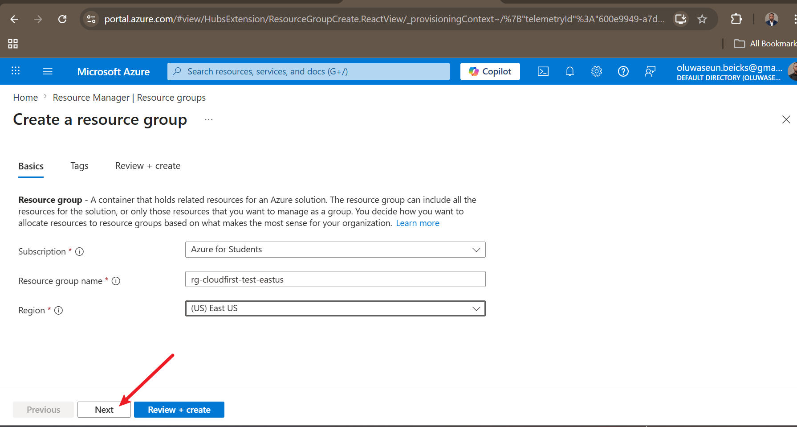

On the **Tags** tab, added three organisational tags to the Resource Group:

| Name | Value |
|---|---|
| Environment | Test |
| Project | CloudFirst-Retail |
| Department | IT-Consulting |

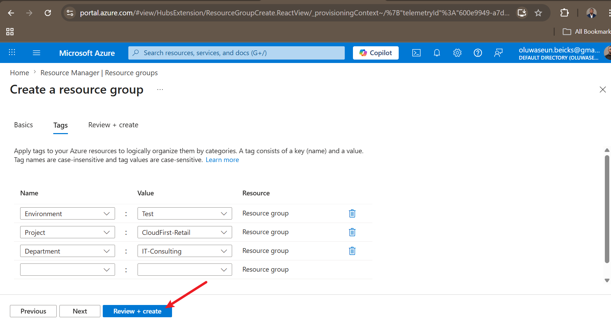

Reviewed all settings and clicked **Create**.

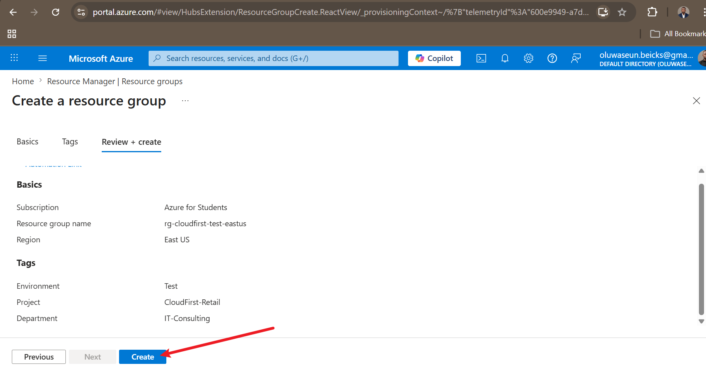

Resource Group `rg-cloudfirst-test-eastus` was successfully created. Clicked on it to enter the RG dashboard.

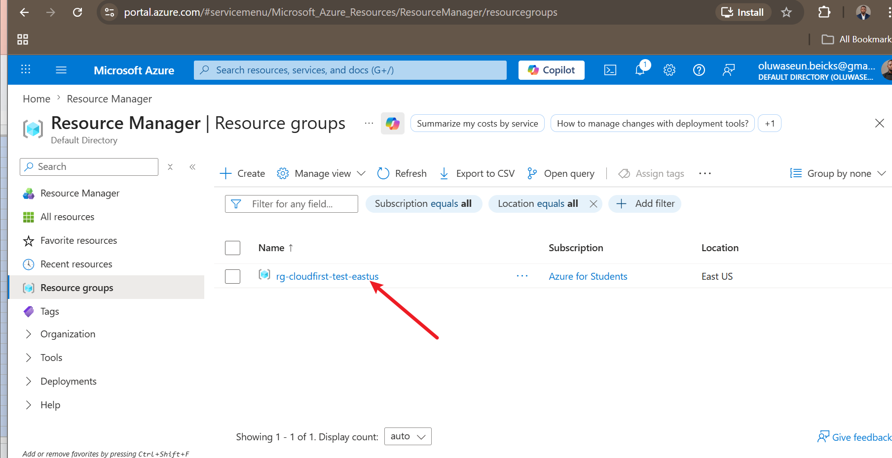

> **Why This Matters:** The RG region only determines where its **metadata** is stored — not where the resources inside must live. This matters for compliance and data residency requirements.

---

### Step 4 — Deploy a Storage Account in a Different Region

From inside the Resource Group, clicked **+ Create** to deploy a resource.

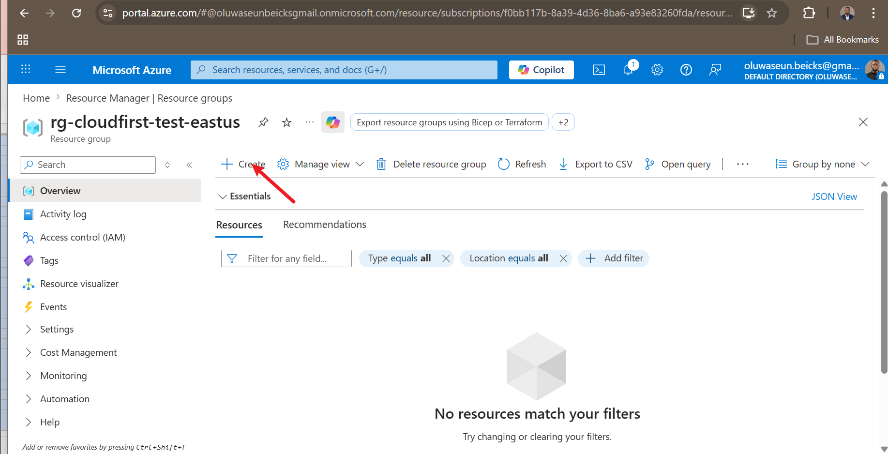

Searched for **Storage account** and selected it from the results.

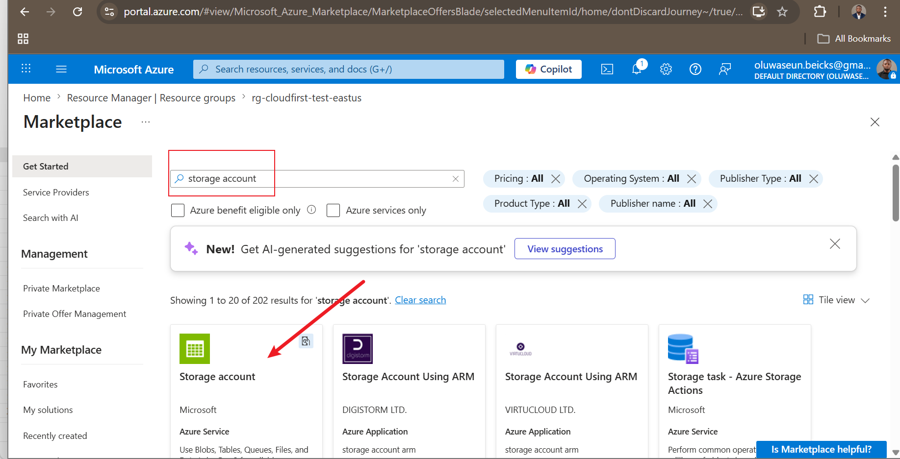

On the Storage Account creation page, confirmed the subscription and plan.

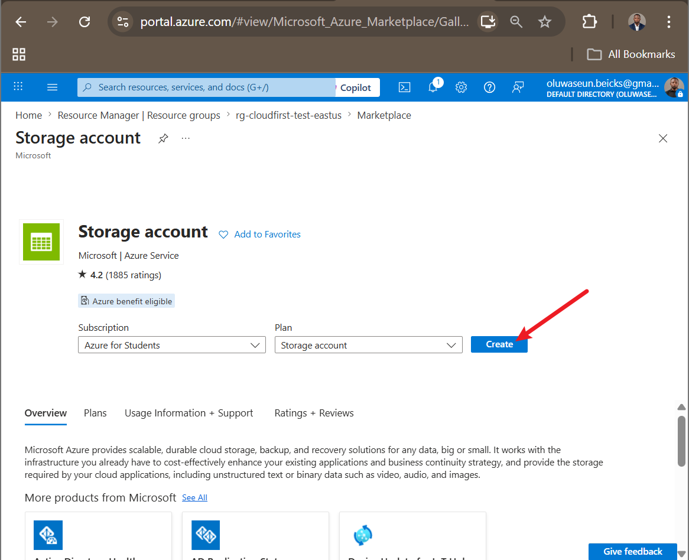

Configured the Storage Account with intentionally different region from the RG to demonstrate that Resource Groups are logical, not physical, boundaries:

- **Subscription:** Pre-selected
- **Resource group:** `rg-cloudfirst-test-eastus` (pre-selected)
- **Storage account name:** `cfretailtest234`
- **Region:** South Africa North *(different from the RG's East US region)*
- **Performance:** Standard
- **Redundancy:** Locally-redundant storage (LRS)

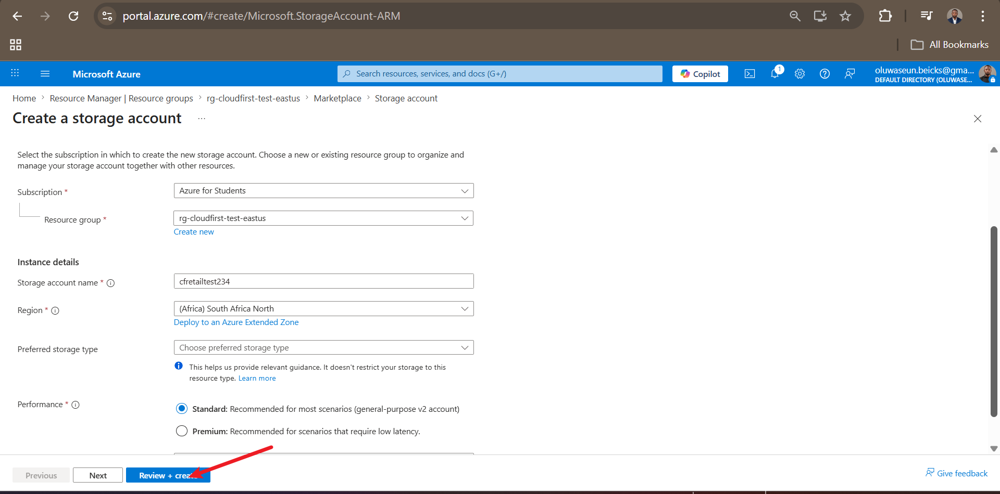

Clicked **Create** to deploy.

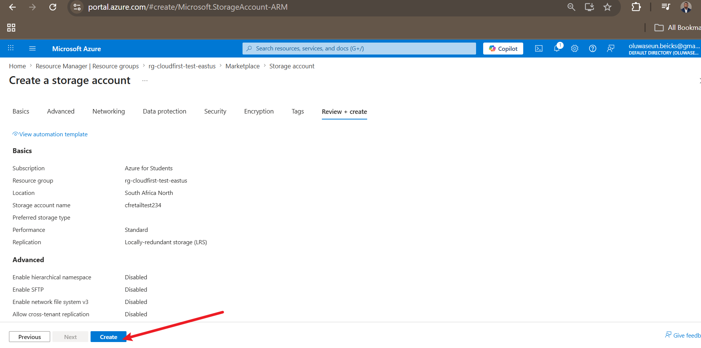

Deployment completed successfully. Clicked **Go to resource**.

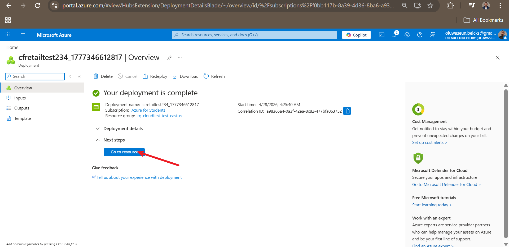

---

### Step 5 — Observe Cross-Region Deployment

In the storage account **Essentials** section, confirmed that the resource location shows **South Africa North** — even though the parent Resource Group is in **East US**. This proves that Resource Groups are purely logical containers with no physical boundary restrictions.

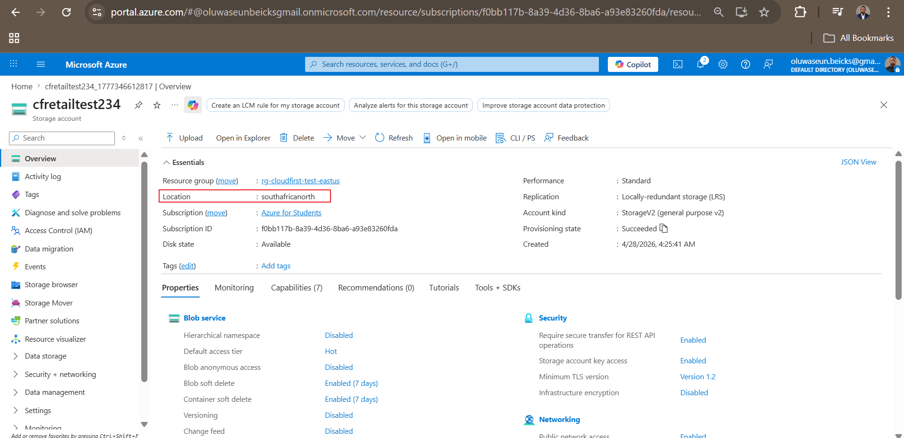

> **Real-World Application:** CloudFirst Retail could have development resources in South Africa, production infrastructure in East US, and manage them all under the same Resource Group for unified governance.

---

### Step 6 — Observe Tag Non-Inheritance (Critical AZ-900 Concept)

Clicked **Tags** under Settings on the storage account. The Tags page was completely **empty** — even though the parent Resource Group had three tags applied.

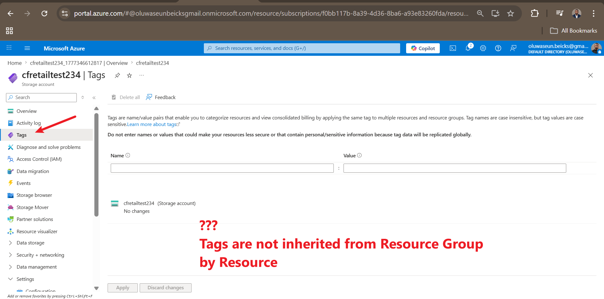

> ⚠️ **Key Concept — Exam Trap:** Tags applied to a Resource Group do **NOT** automatically flow down to resources inside. This is one of the most commonly tested and most commonly misunderstood concepts in AZ-900 and in production environments.

---

### Step 7 — Apply Tags Directly to the Storage Account

Manually applied four tags directly to the storage account to enable accurate cost tracking and organisational management:

| Name | Value |
|---|---|
| Environment | Test |
| Project | CloudFirst-Retail |
| Department | IT-Consulting |
| CostCenter | CC-1001 |

Clicked **Apply** to save.


> **Why This Matters:** These tags now appear in billing reports and cost analysis dashboards. In production, Azure Policy is used to automatically enforce tagging requirements — blocking deployments that don't include required tags like `Project` and `CostCenter`.

---

### Step 8 — View the Azure Resource Hierarchy

Navigated back home and searched for **Subscriptions** to trace the full Azure organisational hierarchy in action.

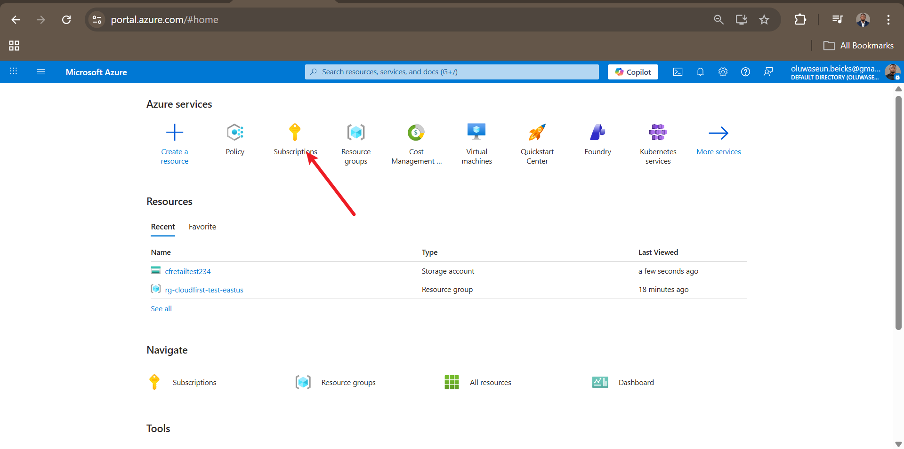

Selected the active subscription.

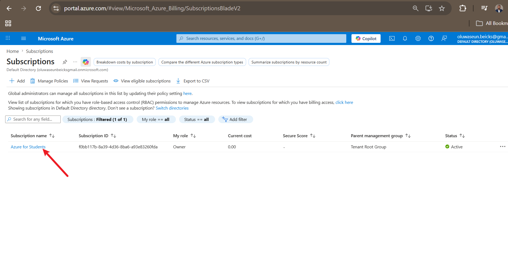

Inside the subscription dashboard, clicked on `rg-cloudfirst-test-eastus` under Resource Groups to confirm the storage account `cfretailtest234` is listed — visually confirming the hierarchy: **Subscription → Resource Group → Resource**.

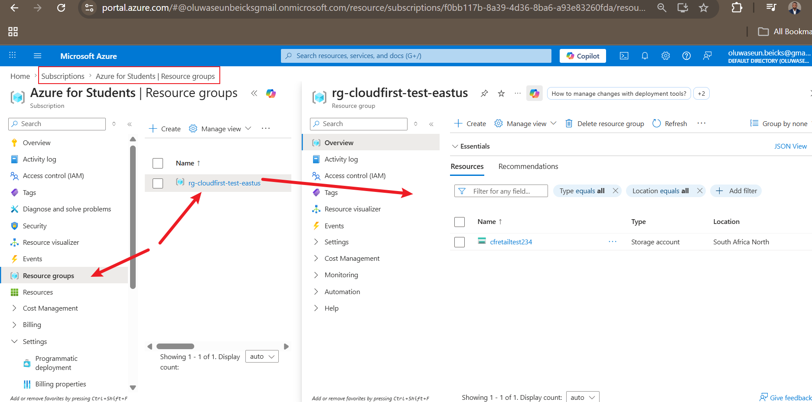

> **Governance Insight:** RBAC permissions and Azure Policies applied at the Subscription or Resource Group level **do** inherit downward to all resources within — unlike tags. This is how enterprises govern thousands of resources with minimal administrative effort.

---

### Step 9 — Explore Cost Management with Tags

Inside the Resource Group, navigated to **Cost Management → Cost Analysis**.

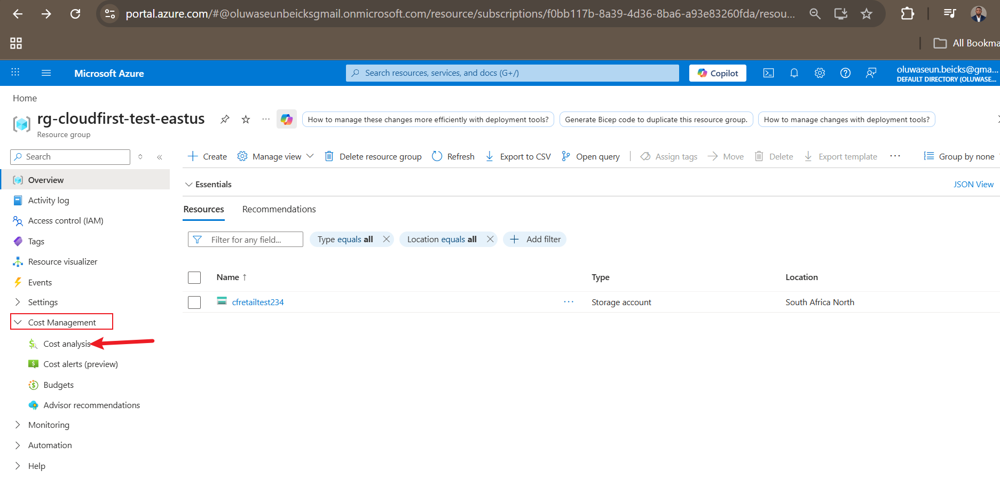

The dashboard showed no data — expected behaviour for newly created resources. Cost data typically takes **8–24 hours** to appear after resource creation.

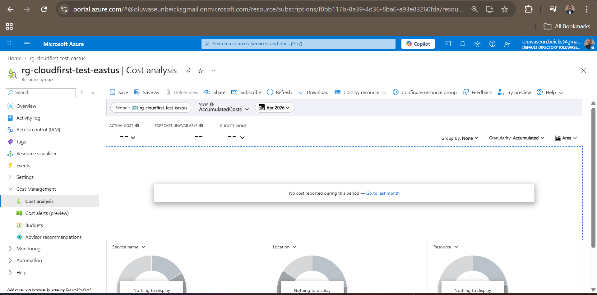

Clicked **View** to explore the available cost breakdown filter options.

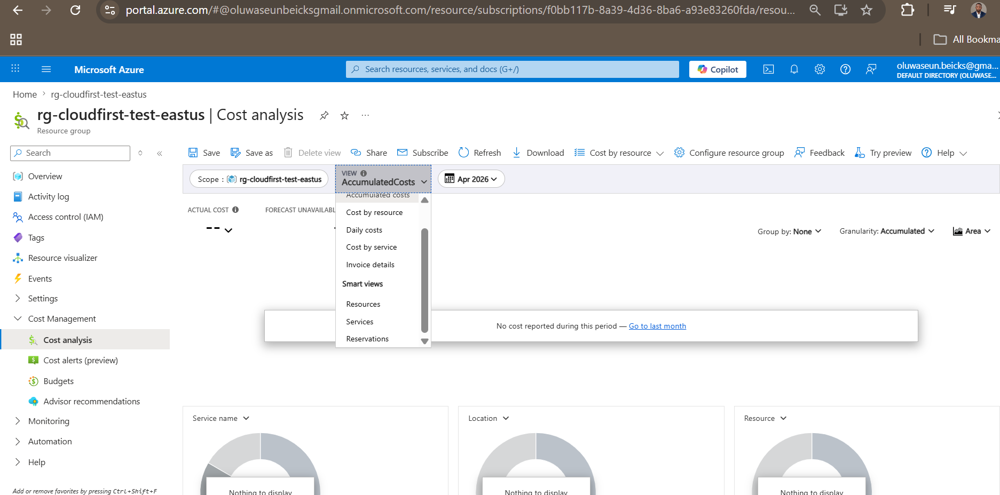

Noted that costs can be grouped and filtered by tags — enabling per-project, per-department, and per-environment cost attribution once data becomes available.

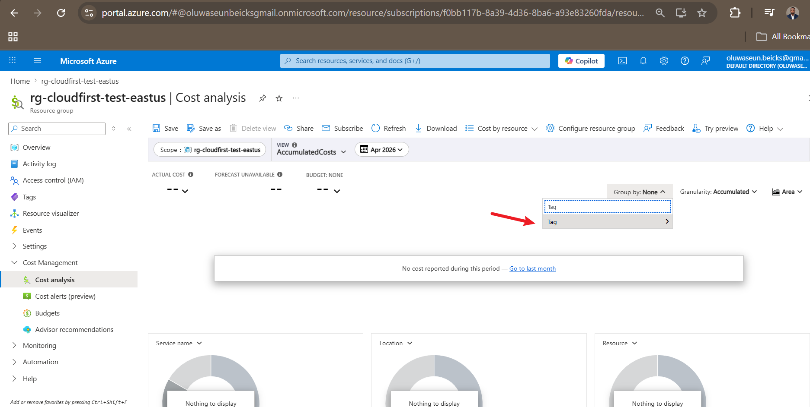

> **Business Impact:** Without consistent resource-level tagging, a total cloud bill gives no visibility into which project or team is driving spend. With tags like `Project=CloudFirst-Retail` and `CostCenter=CC-1001`, finance can allocate costs precisely and identify overruns early.

---

### Step 10 — View ARM Deployment History

From the Resource Group, navigated to **Settings → Deployments** to view the Azure Resource Manager deployment audit trail.


Reviewed the deployment list — noting the **Status** (Succeeded) and the **Duration** it took to provision the storage account.

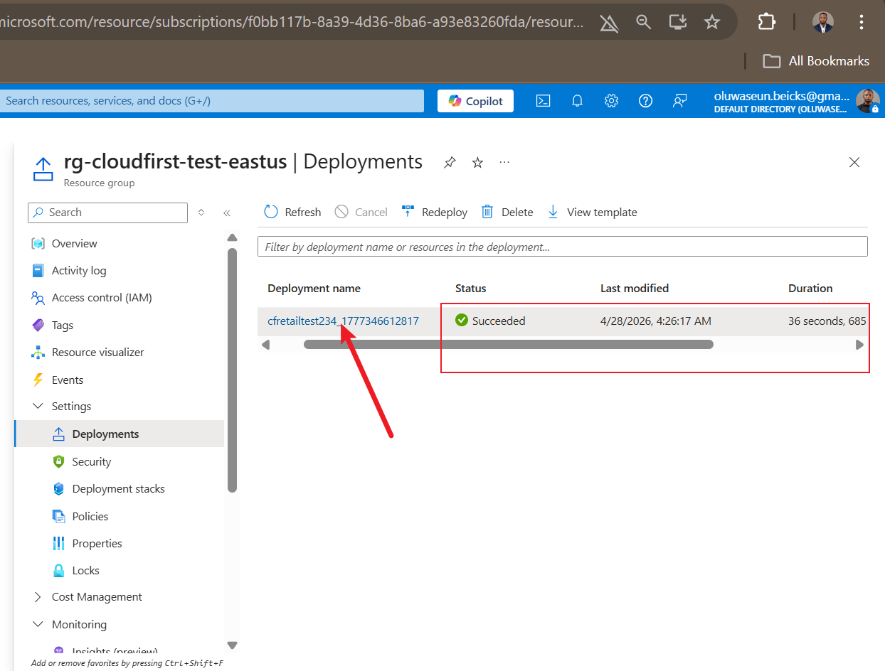

Clicked on the deployment name and explored the **Inputs**, **Outputs**, and **Template** tabs.

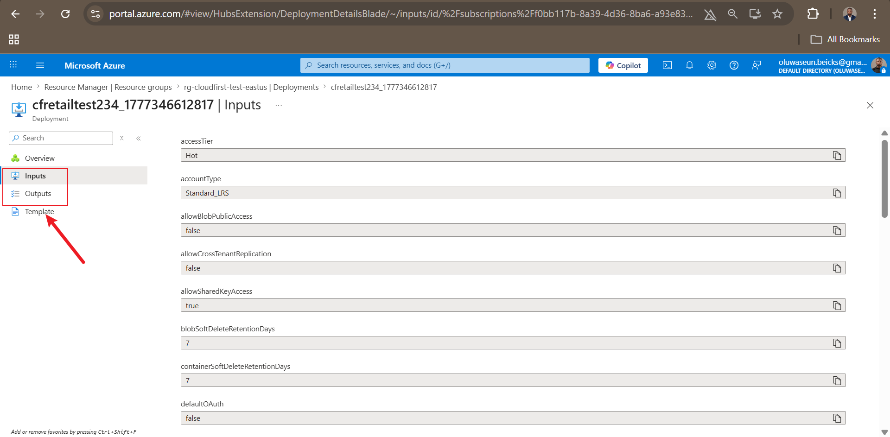

Viewed the underlying **ARM template** — the JSON infrastructure-as-code blueprint that Azure used to provision the storage account. This same template can be exported, version-controlled, and reused for repeatable deployments.

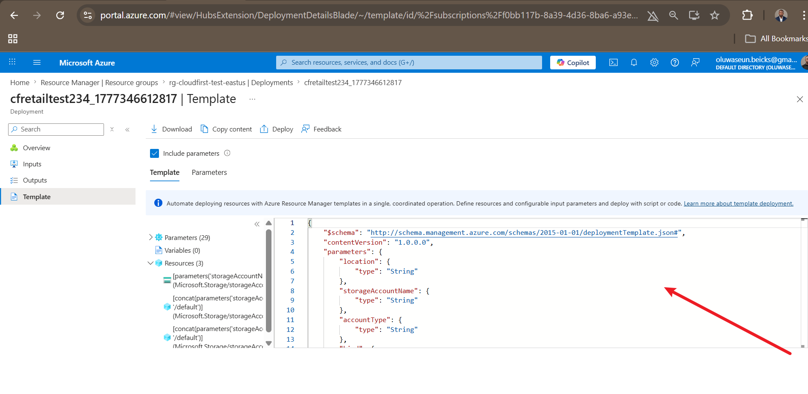

> **DevOps Connection:** Every Azure deployment — whether made through the portal, CLI, or SDK — goes through ARM. The deployment history and exportable templates are the foundation of Infrastructure as Code (IaC) practices that senior cloud engineers rely on.

---

### Step 11 — Explore RBAC and Policy Inheritance

From the Resource Group, navigated to **Access control (IAM) → Role assignments**.


Observed that my account has the **Owner** role — inherited from the Subscription level above. The **Scope** column confirmed the permission originated at the subscription, not the Resource Group itself.

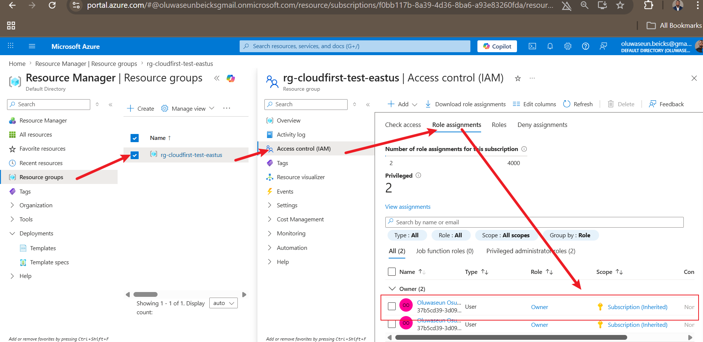

> **Key Distinction — Inheritance Rules:**
> | Feature | Inherits Down? |
> |---|---|
> | RBAC Permissions | ✅ Yes |
> | Azure Policies | ✅ Yes |
> | Tags | ❌ No |

---

## 🏗️ Azure Governance Hierarchy (Visualised)

```
Root Management Group
    └── Management Groups (up to 6 levels)
            └── Subscriptions (billing boundary)
                    └── Resource Groups (logical container)
                            └── Resources (VMs, Storage, Databases...)

Permissions & Policies → flow DOWN ✅
Tags → do NOT flow down ❌
```

---

## 📝 Key Takeaways

**Resource Groups Are Logical, Not Physical**
Resource Groups only store metadata in their selected region. Resources inside can be deployed in any Azure region globally — demonstrated by deploying a storage account in South Africa North inside an East US Resource Group.

**Tag Inheritance Is a Myth (The Most Common Exam Trap)**
Tags must be applied directly and individually to each resource. Tagging only the Resource Group gives a false sense of coverage and leads to incomplete cost reports in production environments.

**RBAC and Policies DO Inherit**
Unlike tags, RBAC permissions and Azure Policies flow automatically from Subscription → Resource Group → Resource. This is the mechanism that enables governance at scale without manually configuring every resource.

**ARM Powers Everything**
Every Azure operation — portal click, CLI command, SDK call — is processed through Azure Resource Manager. ARM's deployment history provides a full audit trail and the exported templates enable repeatable, version-controlled infrastructure deployments (IaC).

**Region Selection Has Real Impacts**
Beyond geography, region choice affects latency, cost (up to 30–50% variance for the same service), data residency compliance, and service availability. Region selection is a deliberate architectural decision, not just a default.

---

## 🧪 Exam Tips (AZ-900)

| Question Pattern | Answer |
|---|---|
| Can resources in a RG be in different regions? | Yes — RG is logical, not physical |
| What happens when you delete a Resource Group? | All resources inside are deleted permanently |
| Do tags on a RG flow to resources inside? | No — tags must be applied to each resource directly |
| What DOES inherit from RG to resources? | RBAC permissions and Azure Policies |
| What handles all Azure deployment requests? | Azure Resource Manager (ARM) |
| What does ARM idempotence mean? | Running the same deployment multiple times produces the same result |
| What sits above Subscriptions in Azure governance? | Management Groups |
| How deep can Management Groups nest? | 6 levels (excluding root) |

---

## 🔗 Resources

- [Azure Portal](https://portal.azure.com)
- [Azure Resource Manager Documentation](https://learn.microsoft.com/en-us/azure/azure-resource-manager/)
- [Azure Naming Conventions](https://learn.microsoft.com/en-us/azure/cloud-adoption-framework/ready/azure-best-practices/naming-and-tagging)
- [Dion Training — AZ-900 Course](https://diontraining.com)

---

*Lab completed by Oluwaseun Osunsola [[View LinkedIn](https://www.linkedin.com/in/oluwaseun-osunsola-95539b175/)] as part of the Microsoft Azure Fundamentals (AZ-900) certification preparation — Section 3: Azure Architecture.*