# Microsoft Azure Fundamentals (AZ-900) — Section 2 Lab
## Cloud Computing Concepts: Service Models, Pricing & Cost Management

> **Lab Provider:** Dion Training | **Estimated Duration:** 15 minutes  
> **Platform:** Microsoft Azure (Free Account) | **Tools Used:** Azure Pricing Calculator · Azure Portal · Cost Management + Billing
> **Completed by: [**Oluwaseun Osunsola**](https://www.linkedin.com/in/oluwaseun-osunsola-95539b175/)**

---

## 📋 Lab Overview

In this hands-on lab, I took on the role of IT consultant for **CloudFirst Retail**, a startup e-commerce company evaluating Azure deployment options. The objective was to compare IaaS vs. PaaS service models, estimate monthly costs, analyze SLA commitments, and explore Azure's consumption-based cost management tools — all in support of a data-driven cloud adoption recommendation.

---

## 🎯 Learning Objectives

- Compare IaaS and PaaS pricing using the Azure Pricing Calculator
- Identify SLA differences between service models
- Navigate the Azure Cost Management + Billing portal
- Understand consumption-based (OpEx) pricing through hands-on resource exploration
- Apply the Shared Responsibility Model to real service selection decisions

---

## 🧰 Prerequisites

- Active Azure free account (no credit card charges)
- Web browser access
- 10–15 minutes of focused time

---

## 🪜 Step-by-Step Walkthrough

---

### Step 1 — Launch the Azure Pricing Calculator

Navigated to the Azure Pricing Calculator at `https://azure.microsoft.com/en-us/pricing/calculator/` to begin estimating costs before any resource deployment. This reinforces Azure's OpEx model and prevents budget surprises.

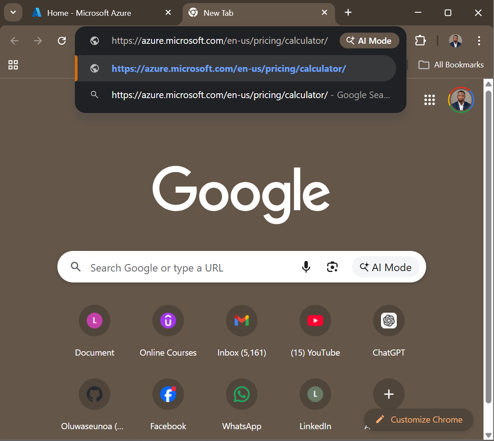

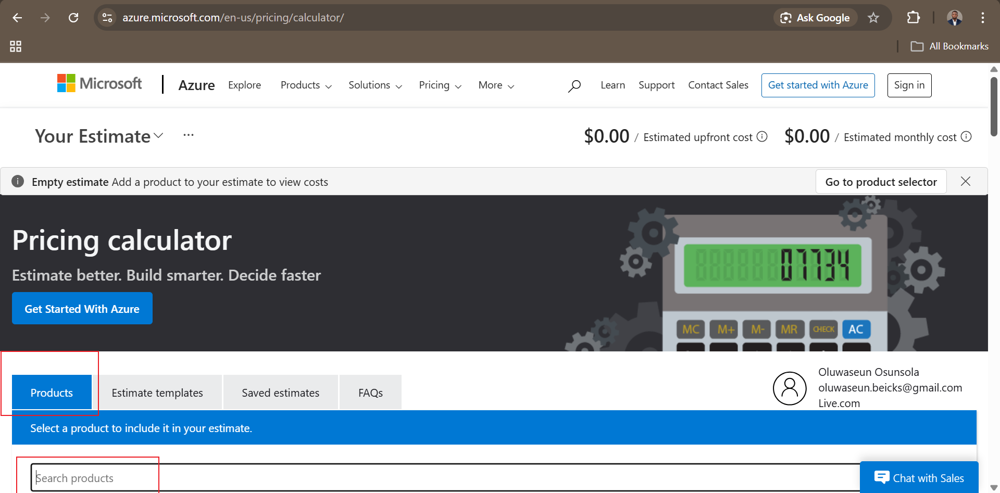

---

### Step 2 — Estimate IaaS Costs (Virtual Machines)

Searched for **Virtual Machines** in the Products search bar and added it to the estimate. This demonstrates IaaS — maximum control, but also maximum customer responsibility.

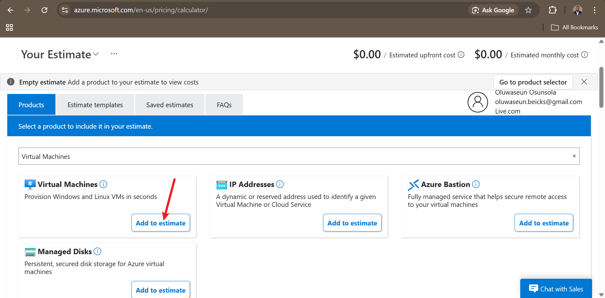

Scrolled down to configure the VM settings:
- **Region:** East US
- **OS:** Windows
- **Tier:** Standard
- **Instance:** D2s v3 (2 vCPUs, 8 GB RAM)
- **Count:** 2 VMs (for high availability)
- **Hours:** 730 (full month, 24/7)

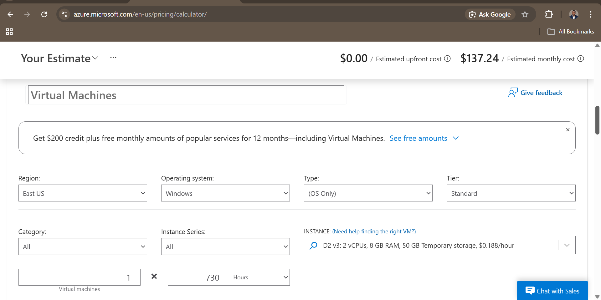

**IaaS Estimated Monthly Cost: $137.24**

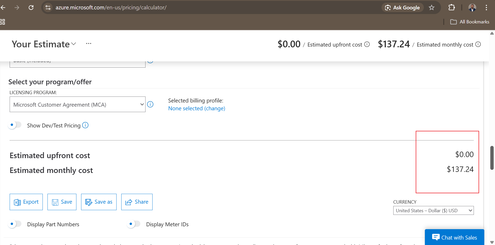

---

### Step 3 — Estimate PaaS Costs (App Service)

Scrolled back to the search bar and added **App Service** to the estimate. PaaS abstracts infrastructure management — Azure handles OS patching, scaling, and availability.

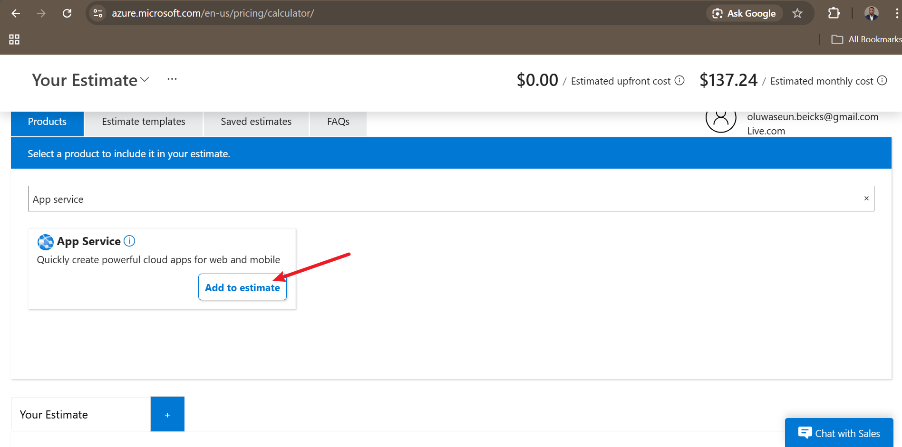

Configured App Service settings:
- **Region:** East US
- **Tier:** Standard
- **Instance:** B1 (1 Core, 1.75 GB RAM)
- **Hours:** 730 (full month)

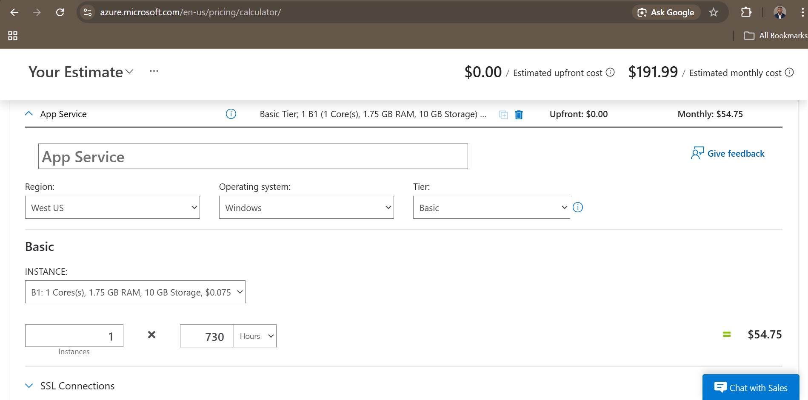

**PaaS Estimated Monthly Cost: $54.75** — roughly 60% cheaper than the IaaS equivalent.

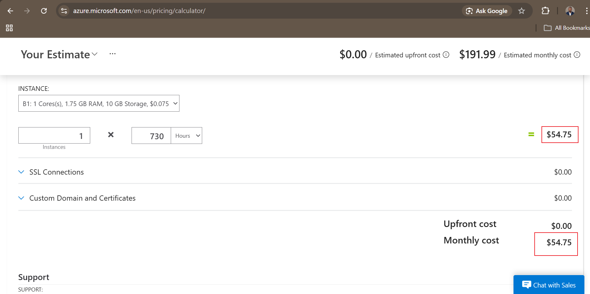

> **Key Insight:** With PaaS (App Service), CloudFirst Retail pays less, avoids OS management overhead, and gains automatic scaling — this is elasticity in action.

---

### Step 4 — Explore Service Level Agreements (SLAs)

Opened the Azure SLA documentation page (`https://azure.microsoft.com/en-us/support/legal/sla/`) in a new tab and downloaded the **Service Level Agreement for Microsoft Online Services (WW)** Word document.

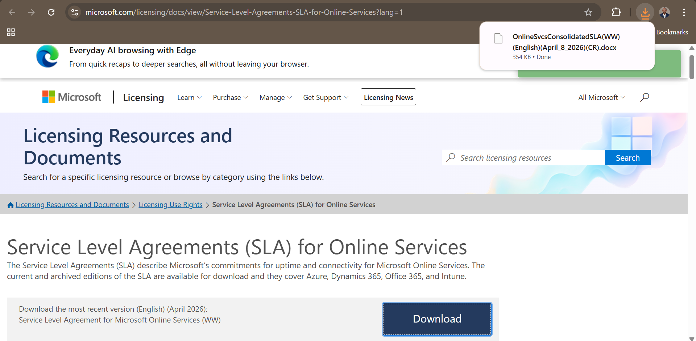

Opened the downloaded document and navigated to the Virtual Machines section.

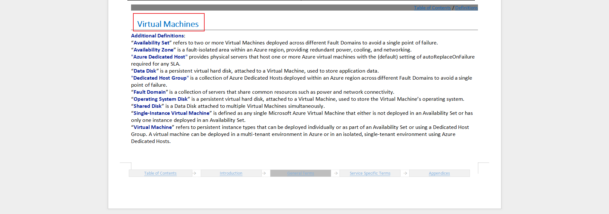

#### 4a — VMs in Availability Zones: **99.99% SLA**

Located the "Uptime Calculation and Service Levels for Virtual Machines in Availability Zones" table.

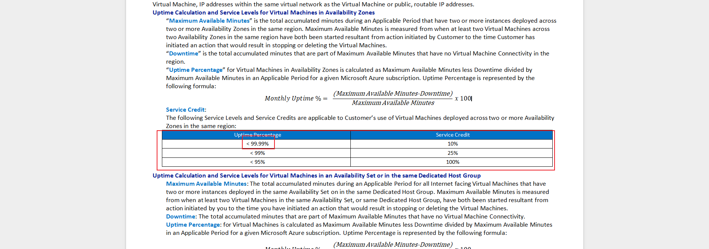

#### 4b — VMs in Availability Set: **99.95% SLA**

Located the "Uptime Calculation and Service Levels for Virtual Machines in an Availability Set" table.

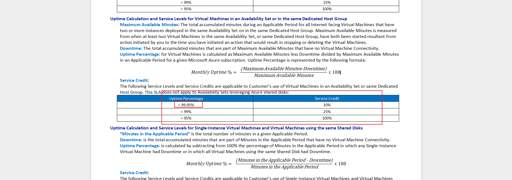

#### 4c — Single-Instance VM (Premium SSD): **99.9% SLA**

Located the "Uptime Calculation and Service Levels for Single-Instance Virtual Machines" table and reviewed the Premium SSD column.

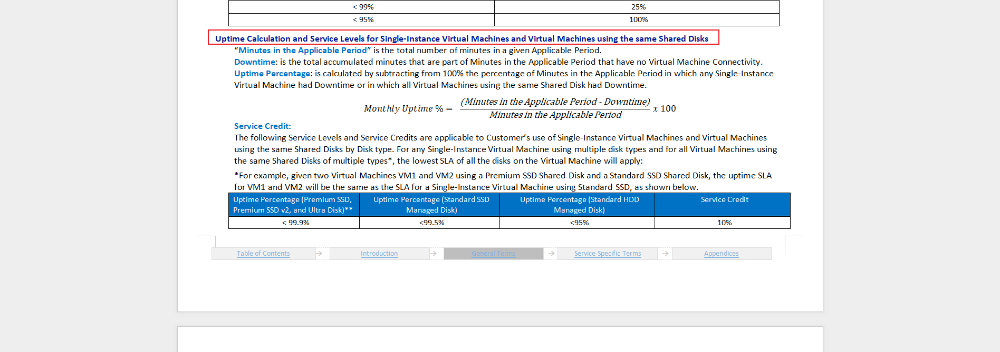

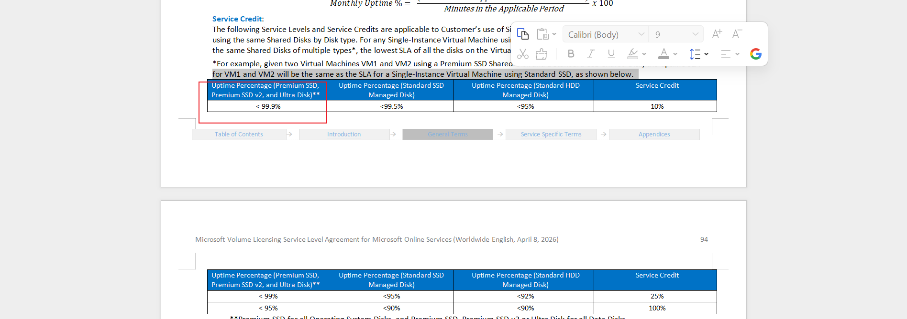

#### 4d — App Service SLA: **99.95%**

Used Ctrl+F to locate the App Service SLA section and noted the uptime guarantee.

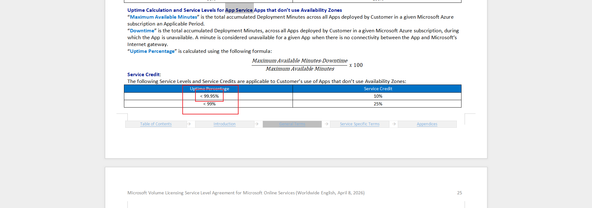

> **Composite SLA Concept:** App Service (99.95%) × SQL Database (99.99%) = **~99.94% composite SLA**. More dependencies always reduce overall availability — composite SLAs multiply, they don't average.

| Configuration | SLA |
|---|---|
| VMs across Availability Zones | 99.99% |
| VMs in Availability Set | 99.95% |
| Single-Instance VM (Premium SSD) | 99.9% |
| App Service | 99.95% |

---

### Step 5 — Access Azure Cost Management + Billing

Signed into the Azure Portal (`https://portal.azure.com`) and searched for **Cost Management + Billing**.

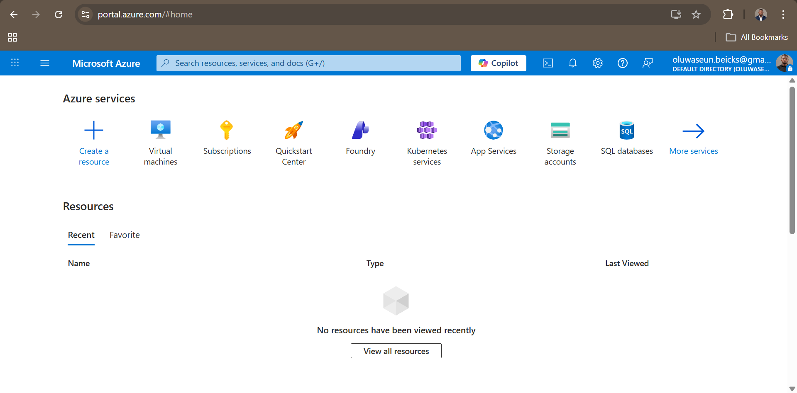

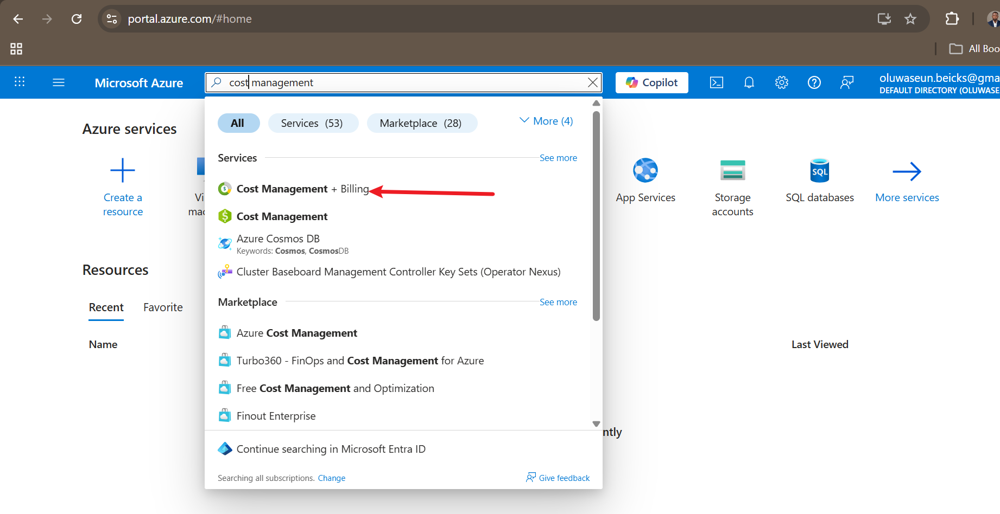

---

### Step 6 — Explore Cost Management Features

#### Cost Analysis Dashboard

Clicked **Cost analysis** under Cost Management → Reporting + Analytics to view the spending dashboard. This is where consumption-based pricing becomes tangible — every resource charge is visible in real time.

#### Budgets

Navigated to **Budgets** under the Monitoring section. This is where spending limits and threshold alerts are configured.

Clicked **Add** to begin creating a budget.

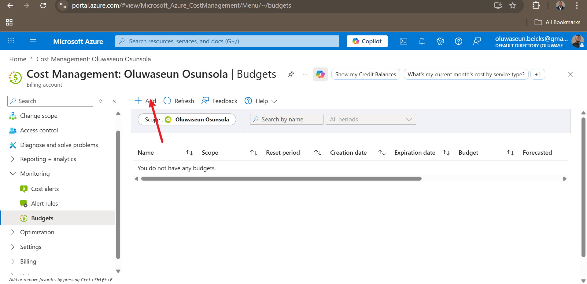

Reviewed the budget creation form — teams can set monthly limits, define alert thresholds (e.g., 80%, 90%), and configure automatic notifications.

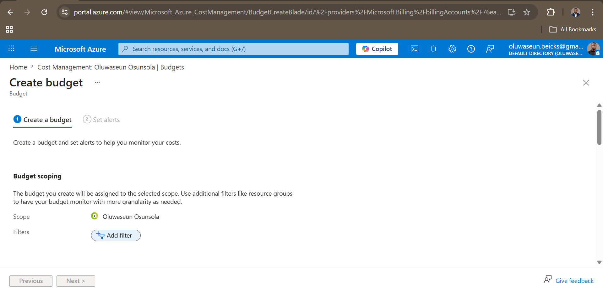

#### Cost Alerts

Navigated back to **Cost alerts** to review alert configuration options for notifying teams when spending approaches defined thresholds.

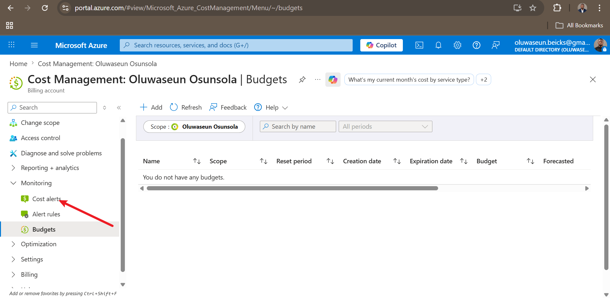

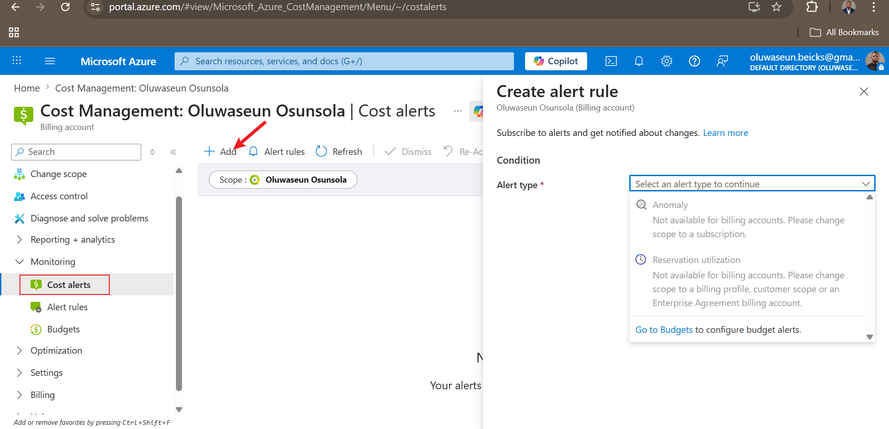

#### Advisor Recommendations

Clicked **Advisor recommendations** under Optimization to review AI-powered cost reduction suggestions. On a free account with no deployed resources, this section may show no recommendations yet.

> **Why This Matters:** These tools transform cloud spending from unpredictable to manageable. Budgets + alerts + Advisor recommendations give full visibility and control over Azure's OpEx model.

---

### Step 7 & 8 — Review Shared Responsibility & Export Cost Estimate

Returned to the Azure Pricing Calculator to review the full estimate and apply Shared Responsibility thinking to each service model. Then exported the estimate as an Excel (`.xlsx`) file for stakeholder presentation.

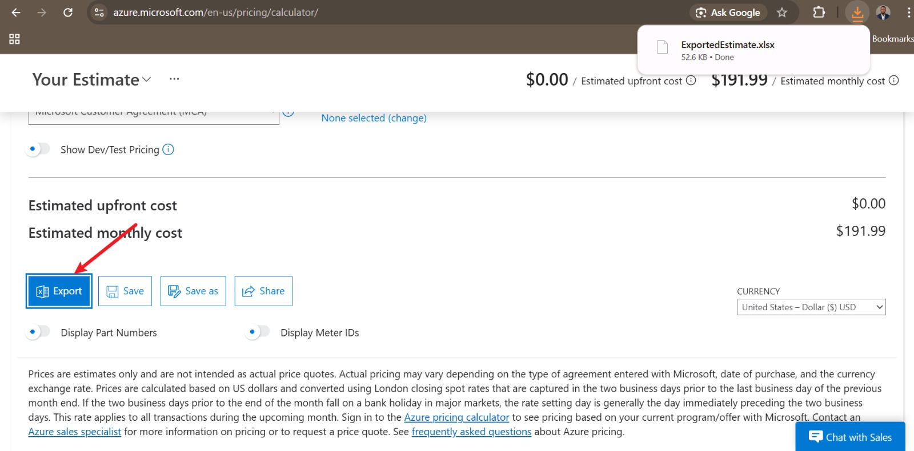

#### Shared Responsibility Summary

| Responsibility Area | IaaS (VM) | PaaS (App Service) | SaaS |
|---|---|---|---|
| Physical datacenter & hosts | Microsoft | Microsoft | Microsoft |
| Operating system patching | **Customer** | Microsoft | Microsoft |
| Network security group rules | **Customer** | Microsoft | Microsoft |
| Application security & code | **Customer** | **Customer** | **Customer** |
| Data security & encryption | **Customer** | **Customer** | **Customer** |
| Identity & access management | **Customer** | **Customer** | **Customer** |

> **Rule of thumb:** No matter the service model, **data security, identity/access management, and endpoint protection are always the customer's responsibility**.

---

## 📊 Cost Comparison Summary

| Service | Model | Monthly Estimate | OS Patching | Scaling |
|---|---|---|---|---|
| 2× D2s v3 Virtual Machines | IaaS | **$137.24** | Customer | Manual |
| App Service S1 | PaaS | **$54.75** | Microsoft | Automatic |

**PaaS delivers ~60% cost savings** while reducing operational overhead and offering built-in elasticity — a compelling business case for CloudFirst Retail.

---

## 📝 Key Takeaways

**Service Model Selection**
- **IaaS** → Maximum control, maximum responsibility, higher costs. Best for legacy apps or OS-level customization.
- **PaaS** → Managed platform, automatic updates, lower costs. Best when the focus is application code, not infrastructure.
- **SaaS** → Zero infrastructure management, pure consumption (e.g., Microsoft 365).

**Consumption-Based Pricing (OpEx)**
- Pay only for what you use — no upfront capital expenditure (CapEx)
- Cost Management tools (budgets, alerts, Advisor) are essential for cost predictability
- Reserved Instances can save up to 72% for predictable, long-running workloads

**SLA Mechanics**
- More "nines" = less downtime: 99.99% = ~52 minutes/year of allowed downtime
- Composite SLAs are calculated by multiplying individual SLAs — dependencies always reduce overall availability
- Use Availability Zones to achieve the highest VM SLA tier (99.99%)

---

## 🧪 Exam Tips (AZ-900)

| Question Pattern | Answer |
|---|---|
| Most OS-level control? | IaaS — Virtual Machines |
| Least infrastructure management? | SaaS — Microsoft 365 |
| Who patches Azure SQL Database? | Microsoft (PaaS platform management) |
| VM compromised via open RDP port — who's responsible? | Customer (network config is customer responsibility) |
| Consumption-based pricing = which financial model? | OpEx (Operational Expenditure) |
| App Service (99.95%) + SQL DB (99.99%) composite SLA? | ~99.94% |
| SLA with < 1 hour downtime per year? | 99.99% (52.56 min/year) |

---

## 🔗 Resources

- [Azure Pricing Calculator](https://azure.microsoft.com/en-us/pricing/calculator/)
- [Azure SLA Documentation](https://azure.microsoft.com/en-us/support/legal/sla/)
- [Azure Portal — Cost Management](https://portal.azure.com)
- [Dion Training — AZ-900 Course](https://diontraining.com)

---

*Lab completed by [**Oluwaseun Osunsola**](https://www.linkedin.com/in/oluwaseun-osunsola-95539b175/) as part of the Microsoft Azure Fundamentals (AZ-900) certification preparation — Section 2: Cloud Computing Concepts.*