# 🐳 Working with Docker Containers: Hands-On Project Report

**Date: December 19, 2025**

## 1. Introduction

Containerization is a foundational technology in modern DevOps, enabling consistent, isolated, and portable application environments. Docker containers package applications with their dependencies, ensuring identical behavior across development, testing, and production.

This project provides a comprehensive, step-by-step hands-on exploration of Docker container management using the official **Ubuntu** image. Each screenshot corresponds to a specific command or action, demonstrating real terminal output and container behavior.

The focus is on practical command-line operations, container lifecycle, interactivity, persistence, and cleanup.

---

## 2. Project Objectives

- Master the Docker container lifecycle
- Execute containers in interactive, detached, and configured modes
- Manage containers using names and IDs
- Perform file system operations inside containers
- Demonstrate data persistence across container restarts
- Apply best practices for stopping, restarting, and removing containers

---

## 3. Prerequisites

- Docker Engine installed and running
- Basic Linux command-line knowledge
- Internet access to pull images from Docker Hub
- Terminal access

---

## 4. Project Workflow and Implementation

### Step 1: View Existing Containers

List all containers (running and stopped) to check for previous Ubuntu instances.

**Command:**
```bash
docker ps -a
```

📷
.png)

---

### Step 2: Start a Stopped Container

Restart an existing stopped container using its ID.

**Command:**
```bash
docker start <container_id>
```

📷
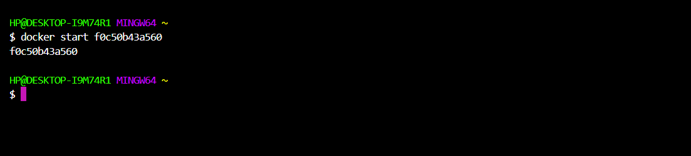

---

### Step 3: Run Container with Advanced Options

Demonstrate environment variables, volume mounts, and port mappings.

**Examples:**
```bash
docker run -e VAR=value ubuntu env
docker run -v /host/path:/container/path ubuntu ls /container/path
docker run -p 8080:80 nginx
```

📷
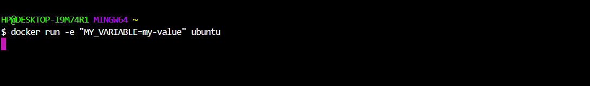

---

### Step 4: Run Container in Detached Mode

Run a container in the background.

**Command:**
```bash
docker run -d --name detached-ubuntu ubuntu sleep infinity
```

📷
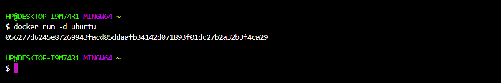

---

### Step 5: Start Container by Name

Start a container using its assigned name.

**Command:**
```bash
docker start <container_name>
```

📷
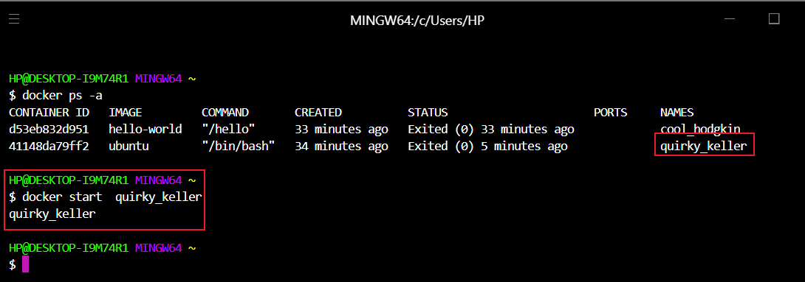

---

### Step 6: Stop Container by Name

Gracefully stop a running container.

**Command:**
```bash
docker stop <container_name>
```

📷
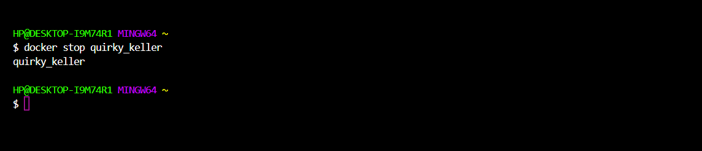

---

### Step 7: Restart Container by Name

Restart a container (stop + start).

**Command:**
```bash
docker restart <container_name>
```

📷
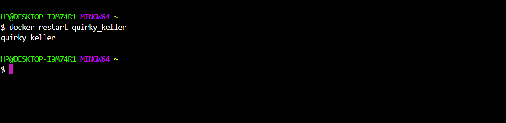

---

### Step 8: Remove a Container

Delete a stopped container and verify removal.

**Commands:**
```bash
docker rm <container_name>
docker ps -a
```

📷
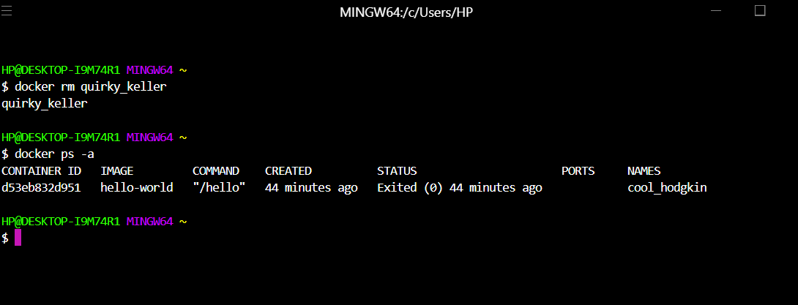

---

### Step 9: Pull the Ubuntu Image

Download the latest Ubuntu image from Docker Hub.

**Command:**
```bash
docker pull ubuntu:latest
```

📷
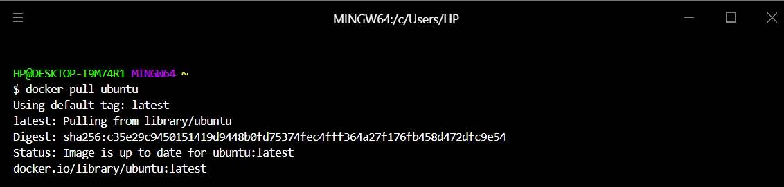

---

### Step 10: Run Ubuntu in Interactive Mode

Start an interactive Bash session with a named container.

**Command:**
```bash
docker run -it --name my-ubuntu ubuntu bash
```

📷
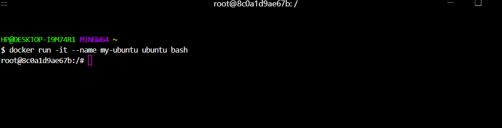

---

### Step 11: Verify OS Information

Confirm the container is running Ubuntu.

**Command:**
```bash
cat /etc/os-release
```

📷
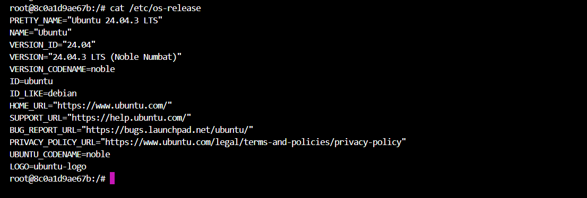

---

### Step 12: Navigate File System

Check current directory and list contents.

**Commands:**
```bash
pwd
ls -la
```

📷
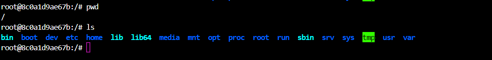

---

### Step 13: Create and Enter Directory

Create and navigate into a new directory.

**Commands:**
```bash
mkdir my-folder
cd my-folder
pwd
```

📷
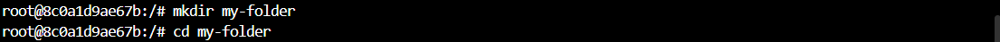

---

### Step 14: Create and View File

Write content to a file and display it.

**Commands:**
```bash
echo "Hello from Docker!" > file1.txt
cat file1.txt
```

📷
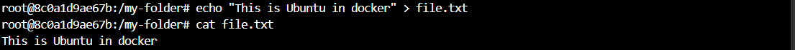

---

### Step 15: Delete Directory

Return to root and remove the directory.

**Commands:**
```bash
cd /
rm -r my-folder
```

📷
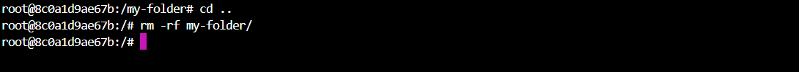

---

### Step 16: Create Persistence Test File

Create a file to test persistence.

**Commands:**
```bash
echo "This will survive restart" > file2.txt
cat file2.txt
```

📷
.png)

---

### Step 17: Exit the Container

Exit the interactive shell.

**Command:**
```bash
exit
```

📷
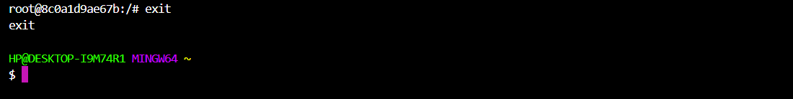

---

### Step 18: Confirm Container Stopped

Verify container is no longer running.

**Command:**
```bash
docker ps
```

📷
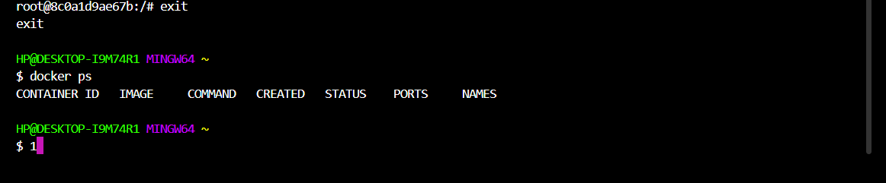

---

### Step 19: Restart and Reattach

Restart the container and re-enter the session.

**Commands:**
```bash
docker start my-ubuntu
docker attach my-ubuntu
```

📷
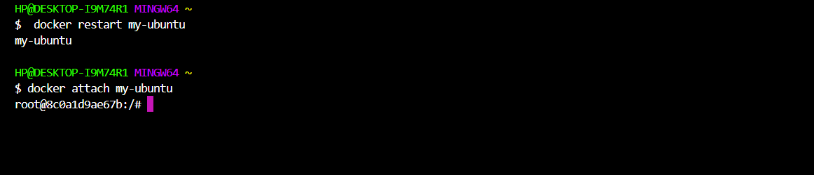

---

### Step 20: Verify File Persistence

Confirm the file from previous session still exists.

**Commands:**
```bash
ls
cat file2.txt
```

📷
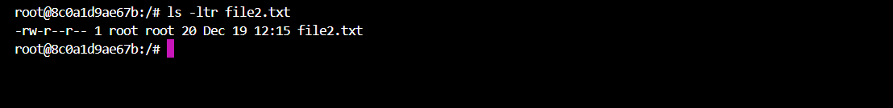

---

### Step 21: Exit Again and Confirm Stopped

Exit and verify container state.

**Commands:**
```bash
exit
docker ps
```

📷
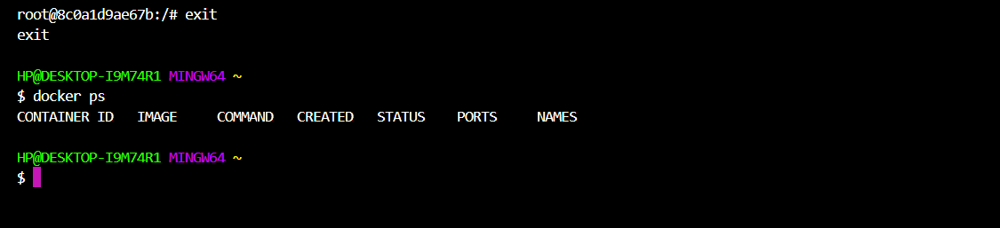

---

### Step 22: List All Containers Before Cleanup

View all containers including stopped ones.

**Command:**
```bash
docker ps -a
```

📷
.png)

---

### Step 23: Remove the Container

Permanently delete the container.

**Commands:**
```bash
docker rm my-ubuntu
docker ps -a  # Verify removal
```

📷
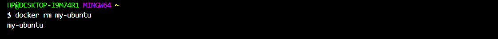

---

## 5. Key Learning Outcomes

- Complete understanding of container lifecycle: create → run → stop → restart → remove
- Proficiency in interactive and detached modes
- Effective container management using names and IDs
- Hands-on file system operations and persistence verification
- Importance of cleanup for resource management

---

## 6. Conclusion

This project delivers a thorough, sequential introduction to Docker container operations through 23 clearly documented steps. Each command is paired with real terminal output, making the learning process visual, reproducible, and practical.

Mastering these fundamentals is essential for DevOps, DevSecOps, cloud engineering, and cybersecurity roles involving containerized environments.

**Recommended Next Steps:**
- Explore Docker volumes for true persistent storage
- Build custom images using Dockerfile
- Manage multi-container apps with Docker Compose
- Implement container networking and security best practices

This hands-on experience forms a solid foundation for advanced container technologies.
