# 🐳 Docker Mastery Project: From Containers to Custom Images & Multi-Container Applications

**Date:** December 19, 2025  
**Student:** [Your Full Name]  
**Institution:** Afe Babalola University (BSc Computer Science)  
**Focus Areas:** Cybersecurity, DevOps, DevSecOps, Containerization

## 1. Introduction

Containerization is a cornerstone technology in modern DevOps and DevSecOps practices. This comprehensive project bridges foundational Docker concepts with advanced real-world workflows.

The project is divided into **two sessions**:

- **Session 1:** Core Docker Container Operations – Lifecycle management, interactivity, persistence, and cleanup using the official Ubuntu image.
- **Session 2:** Advanced Docker – Building a custom Node.js web application image with **Dockerfile** and orchestrating a multi-container stack (Node.js app + MongoDB + Mongo Express) using **Docker Compose**.

This hands-on approach demonstrates end-to-end containerized application development and deployment.

---

## 2. Project Objectives

- Master Docker container lifecycle and management
- Build custom Docker images from scratch
- Orchestrate multi-container applications with Docker Compose
- Implement environment variable management and secret handling
- Demonstrate persistent data storage using MongoDB
- Expose services securely and verify functionality

---

## 3. Prerequisites

- Docker Engine/Desktop installed
- Basic knowledge of Linux commands and Node.js
- Text editor (nano/VS Code)
- AWS EC2 instance (Ubuntu) with Docker and Docker Compose installed (for deployment demo)
- Internet access

---

# Session 1: Core Container Operations

### Step 1: View Existing Containers

List all containers (running and stopped) to check for previous Ubuntu instances.

**Command:**
```bash
docker ps -a
```

📷
.png)

---

### Step 2: Start a Stopped Container

Restart an existing stopped container using its ID.

**Command:**
```bash
docker start <container_id>
```

📷


---

### Step 3: Run Container with Advanced Options

Demonstrate environment variables, volume mounts, and port mappings.

**Examples:**
```bash
docker run -e VAR=value ubuntu env
docker run -v /host/path:/container/path ubuntu ls /container/path
docker run -p 8080:80 nginx
```

📷


---

### Step 4: Run Container in Detached Mode

Run a container in the background.

**Command:**
```bash
docker run -d --name detached-ubuntu ubuntu sleep infinity
```

📷


---

### Step 5: Start Container by Name

Start a container using its assigned name.

**Command:**
```bash
docker start <container_name>
```

📷


---

### Step 6: Stop Container by Name

Gracefully stop a running container.

**Command:**
```bash
docker stop <container_name>
```

📷


---

### Step 7: Restart Container by Name

Restart a container (stop + start).

**Command:**
```bash
docker restart <container_name>
```

📷


---

### Step 8: Remove a Container

Delete a stopped container and verify removal.

**Commands:**
```bash
docker rm <container_name>
docker ps -a
```

📷


---

### Step 9: Pull the Ubuntu Image

Download the latest Ubuntu image from Docker Hub.

**Command:**
```bash
docker pull ubuntu:latest
```

📷


---

### Step 10: Run Ubuntu in Interactive Mode

Start an interactive Bash session with a named container.

**Command:**
```bash
docker run -it --name my-ubuntu ubuntu bash
```

📷


---

### Step 11: Verify OS Information

Confirm the container is running Ubuntu.

**Command:**
```bash
cat /etc/os-release
```

📷


---

### Step 12: Navigate File System

Check current directory and list contents.

**Commands:**
```bash
pwd
ls -la
```

📷


---

### Step 13: Create and Enter Directory

Create and navigate into a new directory.

**Commands:**
```bash
mkdir my-folder
cd my-folder
pwd
```

📷


---

### Step 14: Create and View File

Write content to a file and display it.

**Commands:**
```bash
echo "Hello from Docker!" > file1.txt
cat file1.txt
```

📷


---

### Step 15: Delete Directory

Return to root and remove the directory.

**Commands:**
```bash
cd /
rm -r my-folder
```

📷


---

### Step 16: Create Persistence Test File

Create a file to test persistence.

**Commands:**
```bash
echo "This will survive restart" > file2.txt
cat file2.txt
```

📷
.png)

---

### Step 17: Exit the Container

Exit the interactive shell.

**Command:**
```bash
exit
```

📷


---

### Step 18: Confirm Container Stopped

Verify container is no longer running.

**Command:**
```bash
docker ps
```

📷


---

### Step 19: Restart and Reattach

Restart the container and re-enter the session.

**Commands:**
```bash
docker start my-ubuntu
docker attach my-ubuntu
```

📷


---

### Step 20: Verify File Persistence

Confirm the file from previous session still exists.

**Commands:**
```bash
ls
cat file2.txt
```

📷


---

### Step 21: Exit Again and Confirm Stopped

Exit and verify container state.

**Commands:**
```bash
exit
docker ps
```

📷


---

### Step 22: List All Containers Before Cleanup

View all containers including stopped ones.

**Command:**
```bash
docker ps -a
```

📷
.png)

---

### Step 23: Remove the Container

Permanently delete the container.

**Commands:**
```bash
docker rm my-ubuntu
docker ps -a  # Verify removal
```

📷


---


# Session 2: Building & Orchestrating a Custom Node.js Application

This session implements a full-stack profile editor application using:
- Custom Docker image (Node.js + Express)
- MongoDB for persistent storage
- Mongo Express for database admin UI
- Docker Compose for orchestration

18. **Create Project Folder (NodeJS_Demo_Application_-_Custom_Image) and LS It to Confirm**  
    Create project directory:  
    `mkdir "NodeJS Demo Application - Custom Image" && ls`

    _and_ls_it_to_confirm.png)

19. **Navigate into the Project Folder (NodeJS_Demo_Application_-_Custom_Image)**  
    `cd "NodeJS Demo Application - Custom Image"`

    .png)

20. **MKDIR App to Create App Folder Then CD into App Folder**  
    `mkdir app && cd app`

    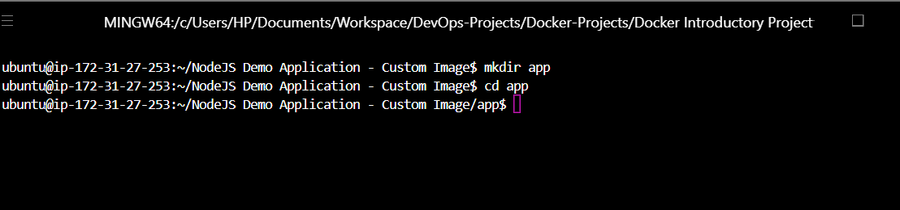

21. **In App Create Images Folder and CD into It**  
    `mkdir images && cd images`

    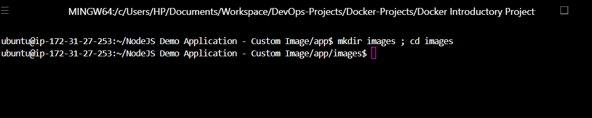

22. **On the Host System Upload an Image to Project Images Folder Using SCP**  
    From local machine:  
    `scp -i your-key.pem profile-1.jpg ubuntu@ec2-ip:~/NodeJS\ Demo\ Application\ -\ Custom\ Image/app/images/`

    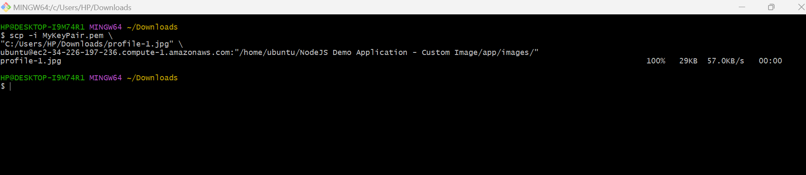

23. **In Image Folder LS to Confirm That Image Is Successfully Uploaded**  
    `ls`

    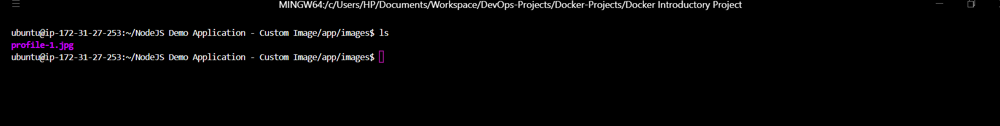

24. **From Image Folder CD Back One Step to App Folder**  
    `cd ..`

    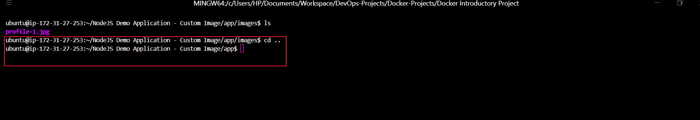

25. **Nano index.html Then Add Code Save and Exit**  
    Create and populate the frontend HTML file.

    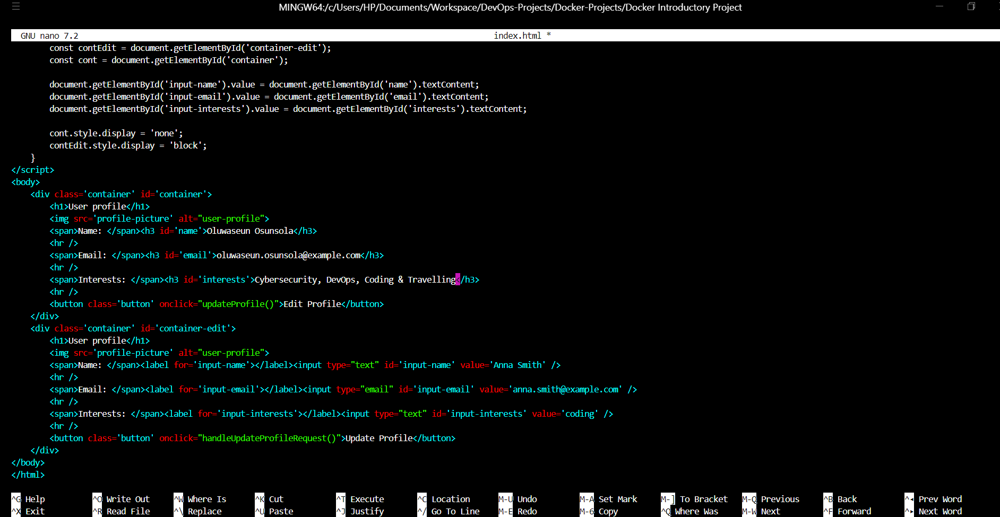

26. **Nano server.js Then Add Code Save and Exit**  
    Create the Express backend server code.

    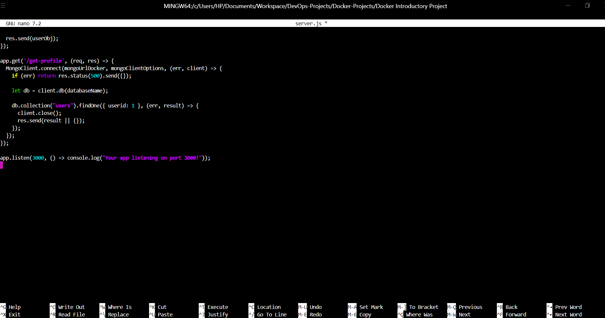

27. **Initialize the Project Folder (Install Node and NPM If You Don't Have and Then Initialize)**  
    Install Node.js if needed, then:  
    `npm init -y`

    .png)

28. **Install the Packages (express, body-parser, mongodb)**  
    `npm install express body-parser mongodb`

    

29. **LS App Folder Cat package.json to Confirm Packages**  
    Verify installed dependencies:  
    `ls && cat package.json`

    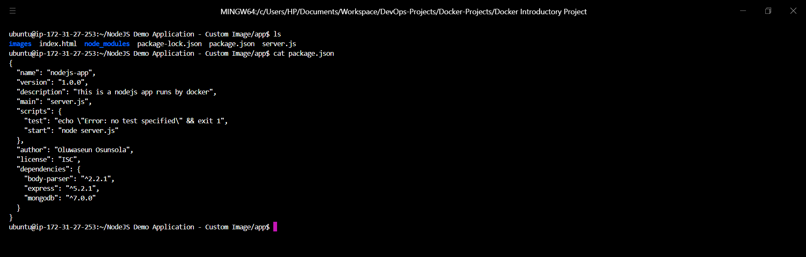

30. **Navigate Back to the Project Folder**  
    `cd ..`

    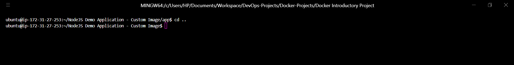

31. **Nano .env Then Add Environment Variables Save and Exit**  
    Create `.env` with MongoDB credentials (e.g., `MONGO_USER=admin`, `MONGO_PASSWORD=password`).

    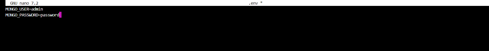

32. **Nano .gitignore Then Add What to Ignore Save and Exit**  
    Add `node_modules/`, `.env`, etc., to `.gitignore`.

    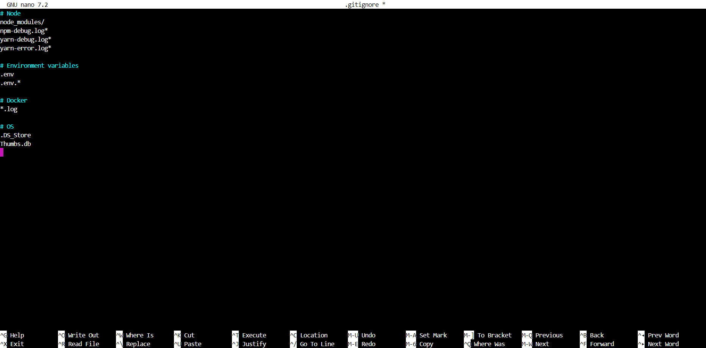

33. **Nano Dockerfile and Add Commands**  
    Write the Dockerfile to build the Node.js image.

    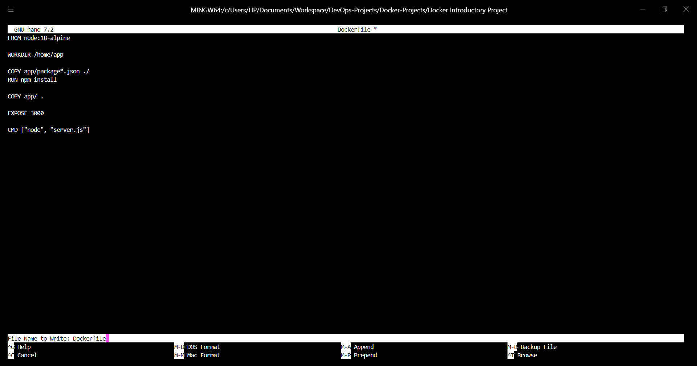

34. **Build Image Using Docker Build -t node-app:1.0**  
    `docker build -t node-app:1.0 .`

    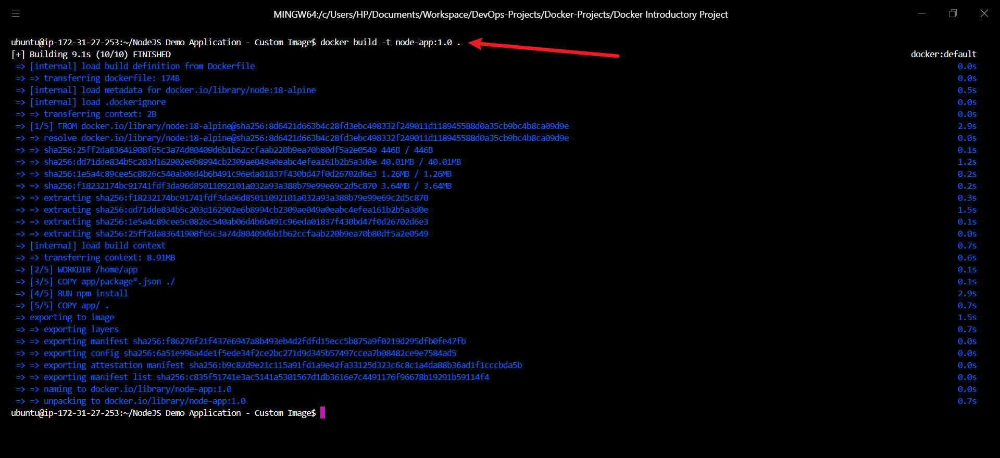

35. **List Images to See the Created node-app:1.0**  
    `docker images`

    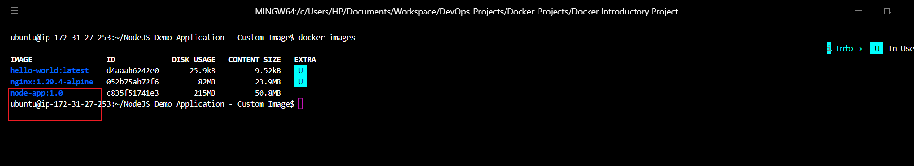

36. **Nano docker-compose.yaml and Add Services and Their Data Save and Exit**  
    Define services: `my-app`, `mongodb`, `mongo-express`.

    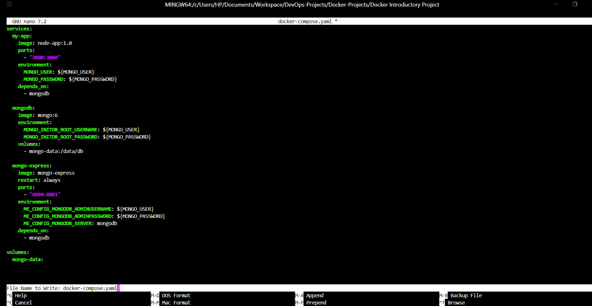

37. **Run Docker Compose --env-file .env Up -d**  
    `docker compose up -d`

    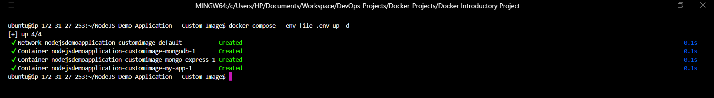

38. **Docker PS to Check Containers Running**  
    `docker ps`

    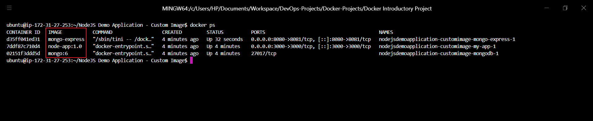

39. **Docker Logs to Check Node.js Application Logs**  
    `docker logs <my-app-container-name>`

    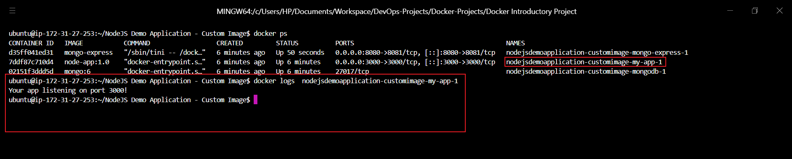

40. **Navigate to Server EC2 Instance Security Group to Edit Inbound Rule**  
    In AWS Console, open the instance's security group.

    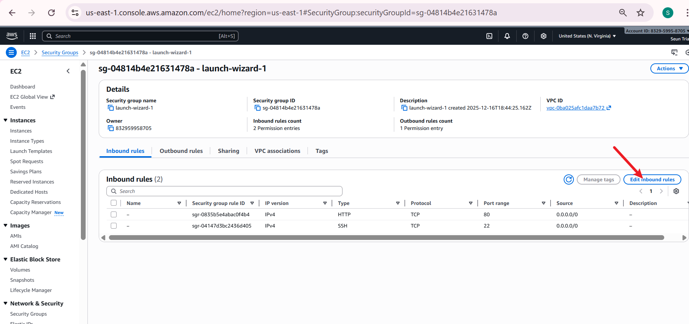

41. **Add Two Rules to Accept Custom TCP Connections from Anywhere on Port 3000 and 8080 Then Save Rules**  
    Add rules: Type=Custom TCP, Port=3000 & 8080, Source=0.0.0.0/0.

    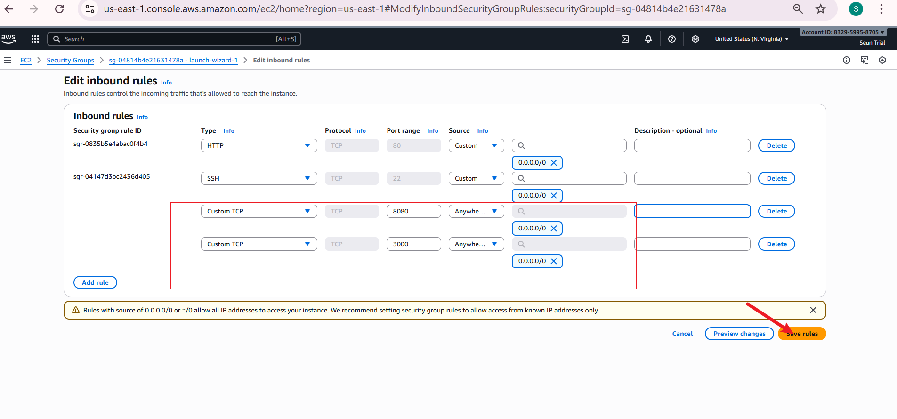

42. **Visit the Public IP on Port 8080 to See Mongo Express**  
    http://ec2-public-ip:8080 → Login with credentials from `.env`.

    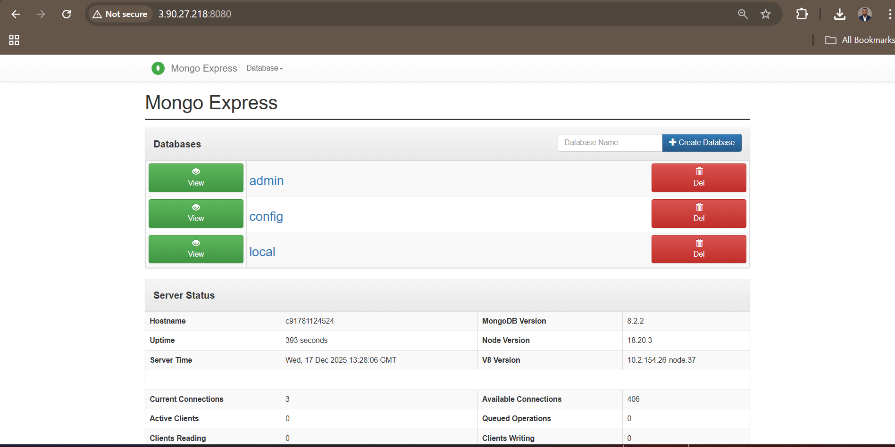

43. **Create my-db Database**  
    In Mongo Express, create database `my-db`.

    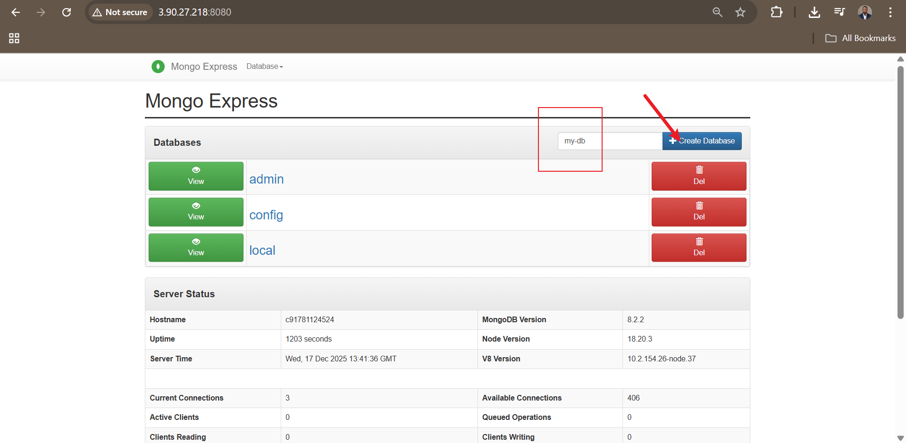

44. **Click on my-db and Create Users Collection**  
    Create collection `users`.

    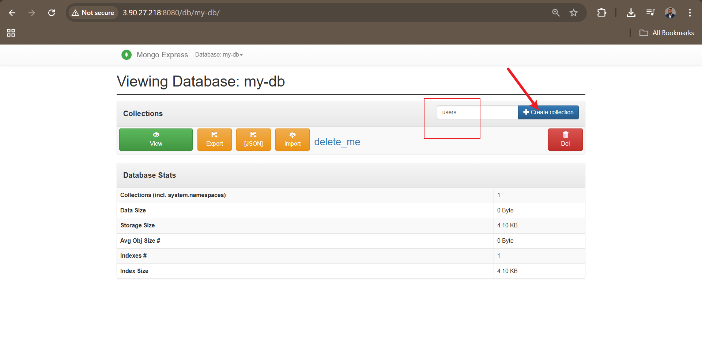

45. **Visit the Public IP on Port 3000 to See the Application**  
    http://ec2-public-ip:3000 → Profile editor loads.

    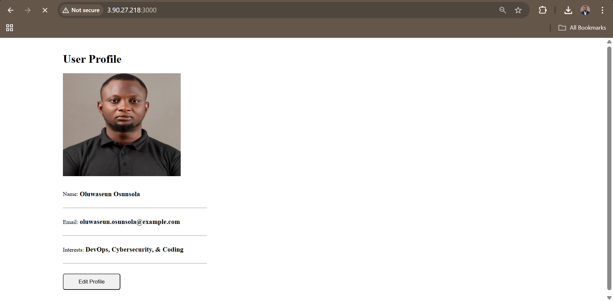

46. **Edit and Update Profile Then Reload to See If Change Is Persistent Across Reload**  
    Edit fields, save, reload page → Data persists (stored in MongoDB).

    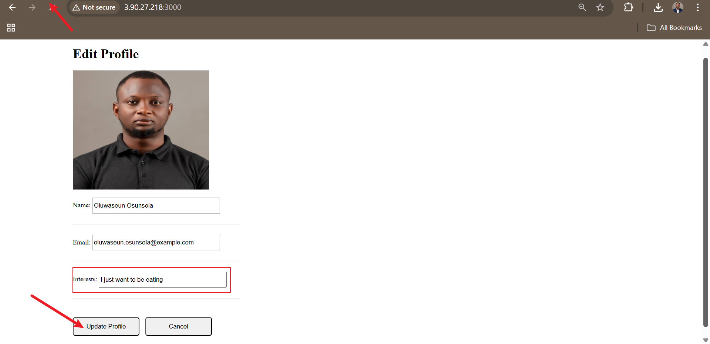
