# Working with Kubernetes Nodes

> **Course Lab Project** | DevOps & Cloud Engineering  
> **Tools:** Minikube · kubectl · Ubuntu (VMware) · Kubernetes
> **Author:** Oluwaseun Osunsola
> **LinkedIn:** [See Profile](https://www.linkedin.com/in/oluwaseun-osunsola-95539b175/)

---

## Table of Contents

- [Working with Kubernetes Nodes](#working-with-kubernetes-nodes)
  - [Table of Contents](#table-of-contents)
  - [Project Overview](#project-overview)
  - [What Is a Kubernetes Node?](#what-is-a-kubernetes-node)
  - [Prerequisites](#prerequisites)
  - [Lab Implementation](#lab-implementation)
    - [Step 1 — Verify Minikube Installation](#step-1--verify-minikube-installation)
    - [Step 2 — Verify kubectl Installation](#step-2--verify-kubectl-installation)
    - [Step 3 — Start the Minikube Cluster](#step-3--start-the-minikube-cluster)
    - [Step 4 — View Nodes in the Cluster](#step-4--view-nodes-in-the-cluster)
    - [Step 5 — View Nodes (Extended / Wide View)](#step-5--view-nodes-extended--wide-view)
    - [Step 6 — Inspect the Node with `describe`](#step-6--inspect-the-node-with-describe)
    - [Step 7 — Observe Conditions, Capacity, Allocatable, System Info \& Address](#step-7--observe-conditions-capacity-allocatable-system-info--address)
    - [Step 8 — Observe Non-Terminated Pods and Events](#step-8--observe-non-terminated-pods-and-events)
    - [Step 9 — Stop the Minikube Cluster](#step-9--stop-the-minikube-cluster)
    - [Step 10 — Confirm Error After Cluster Stop](#step-10--confirm-error-after-cluster-stop)
    - [Step 11 — Restart the Minikube Cluster](#step-11--restart-the-minikube-cluster)
    - [Step 12 — Prove State Persistence (AGE Unchanged)](#step-12--prove-state-persistence-age-unchanged)
    - [Step 13 — Delete the Minikube Cluster](#step-13--delete-the-minikube-cluster)
  - [Key Concepts Demonstrated](#key-concepts-demonstrated)
  - [Commands Quick Reference](#commands-quick-reference)

---

## Project Overview

This project demonstrates the management of Kubernetes nodes using a local Minikube cluster running on Ubuntu inside a VMware environment. The lab covers the full lifecycle of a Minikube cluster — from verification and startup through node inspection, graceful stopping, state persistence, and final deletion — as required by the course instructor.

**Environment:**
| Component | Detail |
|---|---|
| Host OS | Ubuntu (VMware VM) |
| Kubernetes Distribution | Minikube (single-node) |
| CLI Tool | kubectl |
| Node Type | Control plane + worker (combined) |

---

## What Is a Kubernetes Node?

In Kubernetes, a **node** is a physical or virtual machine that runs the Kubernetes software and serves as a worker machine in the cluster. Think of a node as a dedicated employee in an office — responsible for executing tasks and hosting containers to ensure seamless application performance.

Nodes are responsible for running **Pods**, which are the basic deployable units in Kubernetes. Each node in a Kubernetes cluster typically represents a single host system and carries the following core components:

- **kubelet** — agent that communicates with the control plane
- **kube-proxy** — handles network routing for services
- **Container runtime** — runs the actual containers (e.g., Docker, containerd)

In a Minikube setup, a single node acts as both the control plane and the worker, making it ideal for local development and testing without the overhead of a full production cluster.

---

## Prerequisites

Before beginning the lab, both Minikube and kubectl must be installed and accessible from the terminal.

```bash
# Check Minikube
minikube version

# Check kubectl
kubectl version --client
```

---

## Lab Implementation

### Step 1 — Verify Minikube Installation

The first step confirms that the `minikube` binary is installed and accessible in the system path. This ensures the environment is correctly set up before attempting to start any cluster.

```bash
minikube version
```

**Expected output:** Minikube version string confirming it is installed.

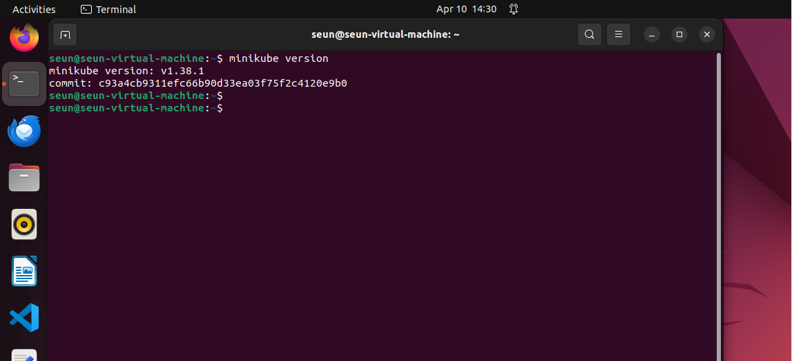

---

### Step 2 — Verify kubectl Installation

`kubectl` is the command-line tool used to interact with the Kubernetes API. This step confirms it is installed and shows the client version.

```bash
kubectl version --client
```

**Expected output:** kubectl client version details.

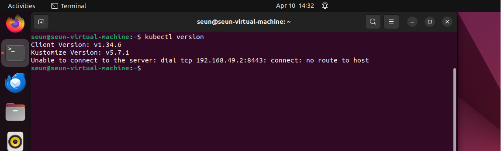

---

### Step 3 — Start the Minikube Cluster

This command provisions a local single-node Kubernetes cluster. Minikube creates a virtual machine (or container, depending on the driver) and configures `kubectl` to point to it automatically. On first run, this may take a few minutes as images are downloaded.

```bash
minikube start
```

**Expected output:**
```
* minikube v1.x.x on Ubuntu xx.xx
* Starting control plane node minikube ...
* Done! kubectl is now configured to use "minikube"
```

The key confirmation line is: **`kubectl is now configured to use "minikube"`** — this tells us kubectl is now wired to the local cluster.

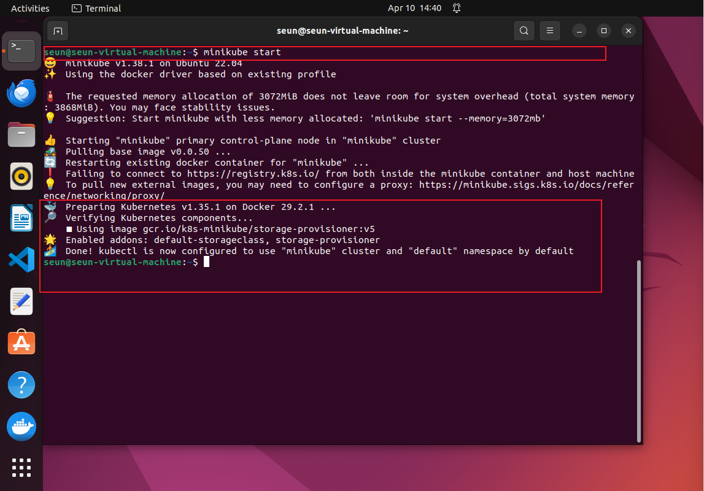

---

### Step 4 — View Nodes in the Cluster

Lists all nodes in the cluster and displays their current status. This is the primary command for verifying that the cluster has an active, healthy node.

```bash
kubectl get nodes
```

**Expected output:**
```
NAME       STATUS   ROLES           AGE   VERSION
minikube   Ready    control-plane   Xm    v1.29.x
```

The `Ready` status confirms the node is healthy and able to accept workloads. The `control-plane` role indicates this node also manages cluster state — typical for single-node Minikube setups.

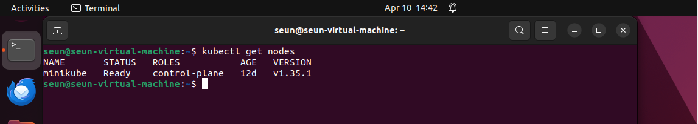

---

### Step 5 — View Nodes (Extended / Wide View)

The `-o wide` flag extends the output with additional details including the internal IP address, external IP, the OS image, the kernel version, and the container runtime. This provides a more complete picture of the node's environment.

```bash
kubectl get nodes -o wide
```

**Additional columns revealed:**
- **INTERNAL-IP** — the node's IP within the cluster network
- **OS-IMAGE** — the operating system running on the node
- **KERNEL-VERSION** — the Linux kernel version
- **CONTAINER-RUNTIME** — shows the runtime (e.g., docker, containerd)

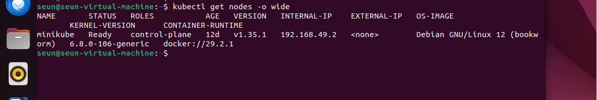

---

### Step 6 — Inspect the Node with `describe`

The `kubectl describe node` command provides a comprehensive, human-readable output of everything Kubernetes knows about a specific node. Replace `<node-name>` with the actual name shown in `kubectl get nodes` — in Minikube this will be `minikube`.

```bash
kubectl describe node minikube
```

This command outputs several key sections which are examined in the following steps. To scroll through the output comfortably:

```bash
kubectl describe node minikube | less
```

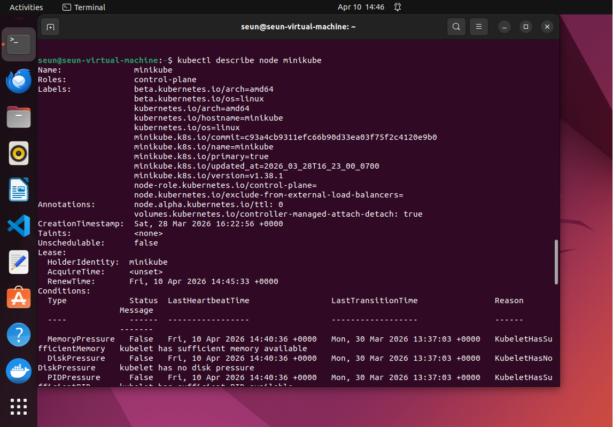

---

### Step 7 — Observe Conditions, Capacity, Allocatable, System Info & Address

Within the `kubectl describe node` output, this step focuses on four critical sections that reveal the node's health, resource limits, and system environment:

| Section | What It Shows |
|---|---|
| **Addresses** | Internal IP, hostname of the node |
| **Conditions** | Health checks — Ready, MemoryPressure, DiskPressure, PIDPressure |
| **Capacity** | Total resources available on the node (CPU, memory, pods) |
| **Allocatable** | Resources available for scheduling pods (after system reservations) |
| **System Info** | OS, kernel, container runtime, kubelet/kube-proxy versions |

The **Conditions** section is particularly important — all conditions except `Ready` should show `False`, while `Ready` should show `True`, confirming a healthy node.


---

### Step 8 — Observe Non-Terminated Pods and Events

The `kubectl describe node` output also contains two sections relevant to workloads and node history:

- **Non-terminated Pods** — lists all pods currently running or scheduled on this node, along with their namespace, CPU requests, and memory limits. Even in a fresh Minikube cluster, several system pods (such as `kube-apiserver`, `coredns`, and `kube-proxy`) will appear here.

- **Events** — shows recent node-level events, such as when the node was registered, when the kubelet started, or any warnings about resource pressure. This is a key debugging section in production environments.

```bash
# These sections appear at the bottom of:
kubectl describe node minikube
```

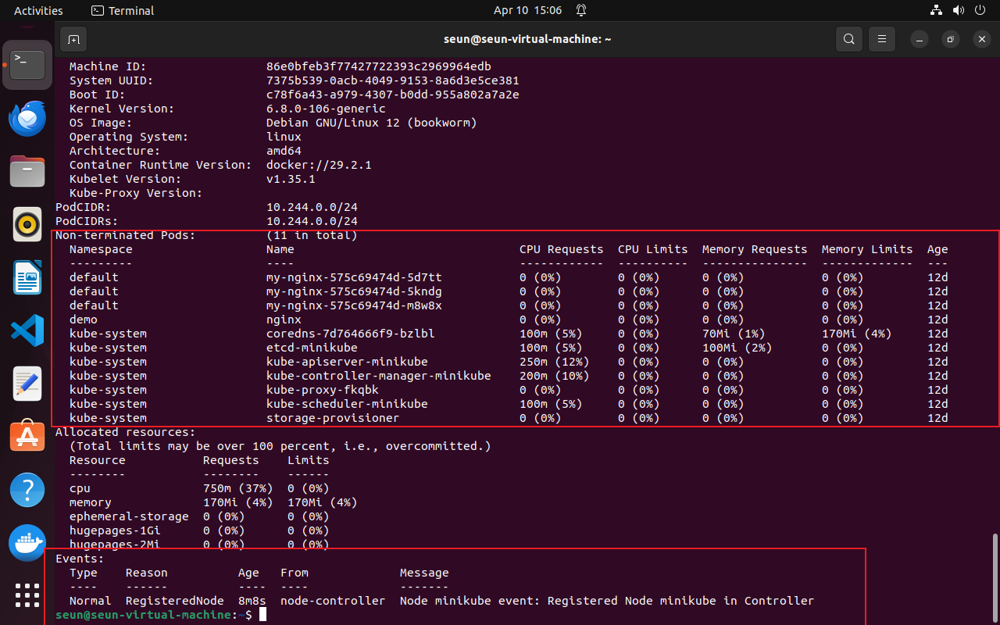

---

### Step 9 — Stop the Minikube Cluster

Stops the running Minikube cluster while **preserving its state**. This is equivalent to shutting down a machine without deleting it — all configurations, deployments, and resources are saved and will be available when the cluster is started again.

```bash
minikube stop
```

**Expected output:**
```
* Stopping node "minikube"  ...
* 1 node stopped.
```

> **Key distinction:** `minikube stop` ≠ `minikube delete`. Stop is reversible; delete is not.

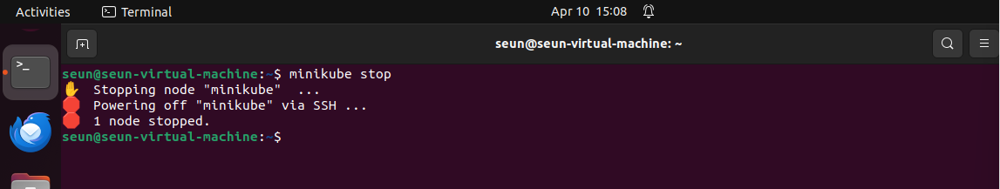

---

### Step 10 — Confirm Error After Cluster Stop

After stopping the cluster, running `kubectl get nodes` demonstrates that the cluster is no longer accessible. This confirms that Minikube must be running for kubectl to communicate with the Kubernetes API.

```bash
kubectl get nodes
```

**Expected output:** A connection error or timeout, such as:
```
The connection to the server 192.168.x.x:8443 was refused
```

This error is expected and intended — it proves the cluster is stopped and the API server is no longer listening.

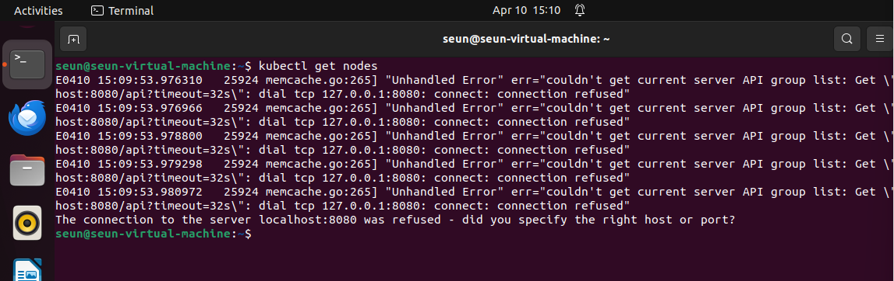

---

### Step 11 — Restart the Minikube Cluster

Restarts the previously stopped cluster. Because `minikube stop` preserves state, this command resumes the cluster rather than creating a new one.

```bash
minikube start
```

This is faster than the initial start since no new images need to be downloaded.

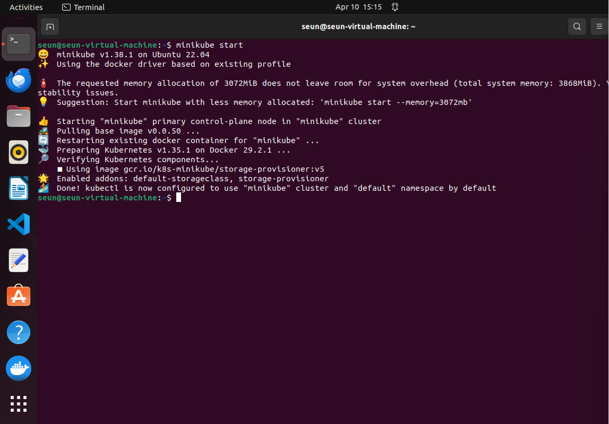

---

### Step 12 — Prove State Persistence (AGE Unchanged)

After restarting, running `kubectl get nodes` again confirms that:

1. The node returns to `Ready` status
2. **The `AGE` value continues from where it was** — it does not reset to `0m`

The persistent `AGE` value is the proof that `minikube stop` preserved the cluster state rather than creating a new one from scratch. This is a key conceptual distinction between `stop` and `delete`.

```bash
kubectl get nodes
```

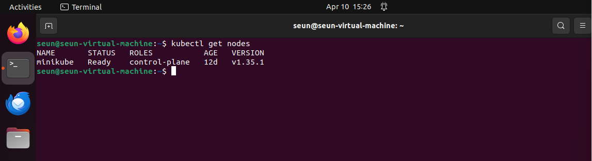

---

### Step 13 — Delete the Minikube Cluster

Permanently deletes the Minikube cluster and all associated resources including VMs, containers, volumes, and network configurations. Unlike `stop`, this action cannot be undone and the `AGE` will reset to zero if the cluster is re-created.

```bash
minikube delete
```

**Expected output:**
```
* Deleting "minikube" in docker ...
* Removed all traces of the "minikube" cluster.
```

> ⚠️ Always capture required screenshots **before** running this command.

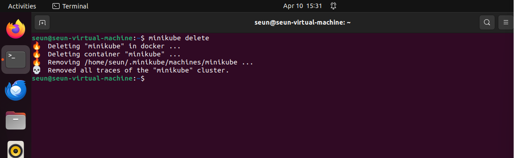

---

## Key Concepts Demonstrated

**Node lifecycle management** — the full flow from `start` → inspect → `stop` → restart → `delete` was exercised, covering all three cluster management commands from the instructor's requirements.

**State preservation vs. deletion** — Steps 9–12 explicitly demonstrate the difference between `minikube stop` (preserves state, AGE persists) and `minikube delete` (destroys everything). This is a critical operational concept when managing development clusters.

**Node inspection depth** — `kubectl describe node` was used to examine all five key sections: Conditions, Capacity, Allocatable, System Info, and Non-Terminated Pods. Understanding these sections is essential for diagnosing node health in any Kubernetes environment.

**Single-node cluster architecture** — Minikube runs the control plane and worker roles on the same node, which is appropriate for local development but differs from production setups where these roles are separated across multiple machines.

---

## Commands Quick Reference

| Command | Purpose |
|---|---|
| `minikube version` | Verify Minikube is installed |
| `kubectl version --client` | Verify kubectl is installed |
| `minikube start` | Start (or resume) the local cluster |
| `minikube stop` | Stop the cluster, preserve state |
| `minikube delete` | Delete the cluster and all resources |
| `kubectl get nodes` | List all nodes and their status |
| `kubectl get nodes -o wide` | List nodes with extended system details |
| `kubectl describe node <name>` | Full inspection of a specific node |
| `kubectl describe node minikube \| less` | Scroll through describe output |

---

*Lab completed on Ubuntu (VMware VM) using Minikube single-node Kubernetes cluster.*